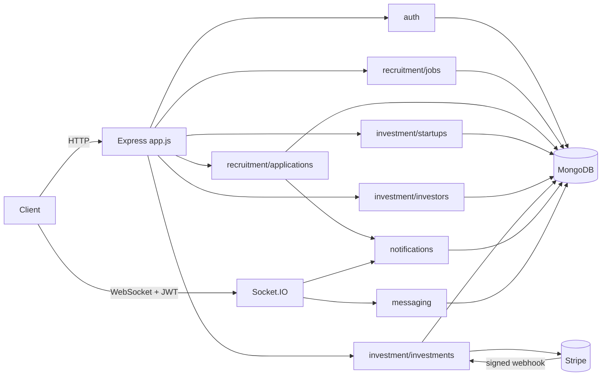
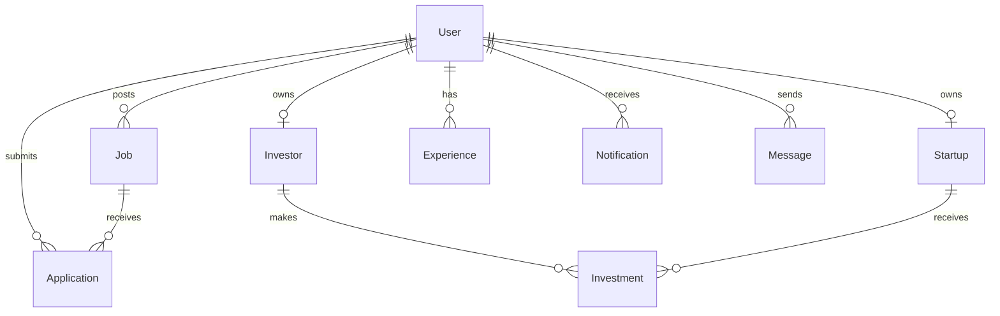

# Recruitment & Investment Platform API

[](https://github.com/mohatab/recruitment-investment-api/actions/workflows/ci.yml)

A Node.js/Express REST API for two connected products sharing one platform:

- **Recruitment** — recruiters post jobs, candidates apply with a CV, and an
  application moves through a real status lifecycle.
- **Investment** — startups publish fundraising profiles, investors save
  criteria and get matched, and an investment is a real Stripe-backed
  payment with server-verified confirmation.

Plus the cross-cutting pieces a platform like this needs: JWT auth with
refresh-token rotation, role-based authorization, real-time notifications
and messaging over Socket.IO, and Swagger/OpenAPI docs generated from the
route annotations.

**Further reading:** [`docs/ARCHITECTURE.md`](./docs/ARCHITECTURE.md) (request
lifecycle, auth/payment/webhook/real-time flows, error handling) ·
[`docs/DATABASE.md`](./docs/DATABASE.md) (collections, relationships, indexes,
and why) · [`AUDIT.md`](./AUDIT.md) / [`FINAL_AUDIT.md`](./FINAL_AUDIT.md)
(before/after) · [`PORTFOLIO_REVIEW.md`](./PORTFOLIO_REVIEW.md) (engineering
highlights, limitations, interview talking points).

## Problem statement / origin

This started as three unrelated student mini-projects (recruitment, investor/
startup management, notifications) glued into one Express app, each with its
own `User` model and its own JWT scheme. `AUDIT.md` is the full record of
that state — including confirmed critical bugs (a hardcoded JWT secret, a
password-reset path that stored plaintext passwords, an unauthenticated
Socket.IO layer that let any client join any user's private room) — and the
rationale behind every structural decision below. This README describes the
result of fixing that; `AUDIT.md` describes what was actually wrong and why.

## Features

- JWT auth (access + rotating refresh tokens), role-based authorization
  (`candidate` / `recruiter` / `investor` / `startup` / `admin`)
- Job posting, search/filtering/pagination, and a full application lifecycle
  with enforced status transitions and duplicate-application prevention
- Startup fundraising profiles, investor criteria, and a matching endpoint
- Stripe-backed investments with a **signature-verified webhook**, idempotent
  PaymentIntent creation and refunds, a processed-event log, and automatic
  refunds for payments that arrive after a round is full — payment
  state is never trusted from the client
- Real-time notifications and authenticated direct messaging over Socket.IO:
  rooms are derived from the verified session (never from a payload), every
  event is validated, rate-limited and crash-proofed, and presence is
  reference-counted per connection and visible only to conversation partners
- Private file storage: uploads are content-verified (magic bytes, not just
  the declared type), stored under server-generated keys outside any served
  directory, and readable only through authorized download endpoints
- Centralized error handling, structured logging, rate limiting, Helmet,
  Mongo-injection sanitization, request correlation IDs
- Swagger/OpenAPI docs at `/api-docs`

## Architecture

```
src/
  app.js, server.js        Express app assembly + HTTP/Socket.IO bootstrap
  config/                  env loading + validation, MongoDB connection
  common/                  middleware, errors, utils, storage abstraction — shared by every module
  docs/swagger.js          OpenAPI spec generation
  realtime/                Socket.IO auth, room/presence management
  modules/
    auth/                  register/login/refresh/logout, password reset
    users/                 profile, password change, CV upload
    recruitment/
      jobs/                job postings
      applications/        applications, status lifecycle
    investment/
      startups/            fundraising profiles, success-assessment heuristic
      investors/           investor profiles + criteria, matching
      investments/         Stripe-backed investments
    payments/              Stripe client + webhook handler
    notifications/         in-app notifications
    messaging/             direct messages
    experience/            candidate work history
    contact/               public contact form
    health/                liveness/readiness check
```

Each module is self-contained: `*.routes.js` → `*.controller.js` →
`*.service.js` (business logic + authorization checks) → `*.model.js`
(Mongoose schema) → `*.validation.js` (Joi schemas). Routes never touch
Mongoose directly.



## Tech stack

Node.js / Express · MongoDB + Mongoose · Socket.IO · JWT + bcryptjs · Stripe
· Multer (+ optional S3 via `@aws-sdk/client-s3`) · Joi · Jest + Supertest +
`mongodb-memory-server` · swagger-jsdoc/swagger-ui-express · Docker.

## Authentication & roles

- **Access tokens**: JWTs (`JWT_ACCESS_EXPIRES_IN`, default `15m`) sent as
  `Authorization: Bearer <token>`. Every authenticated request (and every
  Socket.IO handshake) also checks the stored user: the account must be active
  and the token's session generation (`ver`) must match `User.tokenVersion`.
  Role is taken from the stored user, never from the request.
- **Refresh tokens**: opaque, single use, stored as SHA-256 hashes, 7 days by
  default. `POST /api/v1/auth/refresh` consumes the token atomically, so concurrent
  requests can't both succeed. **Replaying an already-rotated token revokes
  every session of that user** (reuse detection).
- **Session revocation**: changing or resetting the password, admin
  deactivation, `POST /api/v1/auth/logout-all` and refresh-token reuse all increment
  `User.tokenVersion`, which invalidates every outstanding access and refresh
  token and disconnects the user's open sockets. `POST /api/v1/auth/logout`
  revokes a single refresh token. Changing the password returns a fresh token
  pair for the caller.
- **Passwords**: bcrypt; at least 8 characters and at most 72 bytes (bcrypt's
  input limit, rejected rather than silently truncated).
- **Deactivated accounts** get `403 ACCOUNT_DISABLED` at login, but only after
  the correct password, so account status isn't disclosed to guessers. Admins
  toggle status with `PATCH /api/v1/users/:id/status`.
- **Email verification**: registration emails a link
  (`${APP_URL}/verify-email#token=…`, valid 24 h, single use). The client app
  posts the token to `POST /api/v1/auth/verify-email`. Unverified users can sign
  in and manage their profile, but posting jobs and starting investments
  returns `403 EMAIL_NOT_VERIFIED`. Without SMTP configured in local
  development, mark an account verified with
  `db.users.updateOne({ email: "you@example.com" }, { $set: { emailVerifiedAt: new Date() } })`.
- **Password reset**: `POST /api/v1/auth/forgot-password` returns immediately with
  the same body for any email; the lookup and email happen afterwards, so
  timing doesn't reveal registered addresses. The link
  (`${APP_URL}/reset-password#token=…`) is valid 1 hour and single use, a newer
  link supersedes an older one, and at most one email per account is sent per
  minute. A successful reset revokes every session. Tokens sit in the URL
  fragment, so they never reach the client app's server logs.
- `admin` cannot be self-registered; it's provisioned directly in the database.

| Role      | Can do                                                                           |
| --------- | -------------------------------------------------------------------------------- |
| candidate | apply to jobs, manage own profile/experience/CV                                  |
| recruiter | post/manage jobs, review & move applications through their lifecycle             |
| startup   | manage one fundraising profile, view investments received                        |
| investor  | manage criteria (private), browse/match startups, create investments             |
| admin     | list users, activate/deactivate accounts, send notifications, refund investments |

## API documentation

Interactive docs at `/api-docs` when the app is running (generated from the
route JSDoc annotations, so it can't describe an endpoint that doesn't
exist). Every endpoint documents its auth requirement, request/response
shape, and error responses.

### Versioning

Every application endpoint lives under **`/api/v1`**. The health probes
(`/health`, `/health/ready`) sit outside the prefix on purpose: they are
infrastructure endpoints for orchestrators, not part of the product API, and
must not move when `v2` arrives.

### Response envelope

```json
{ "success": true, "data": {}, "message": "..." }
```

List endpoints add `pagination`:

```json
{ "success": true, "data": [], "pagination": { "page": 1, "limit": 20, "total": 42, "totalPages": 3 }, "message": "OK" }
```

Errors always carry a stable code and the request id (also sent as the
`X-Request-Id` header):

```json
{
  "success": false,
  "error": { "code": "VALIDATION_ERROR", "message": "...", "details": [{ "field": "email", "message": "..." }] },
  "requestId": "0b2ef09f-90cd-4ac6-bd52-1dbd4a2f0b2f"
}
```

`204` responses (deletes) have no body, and the Stripe webhook answers in
Stripe's own format rather than this envelope.

### Status codes

| Code            | Meaning                                                                                                                                                                                                                            |
| --------------- | ---------------------------------------------------------------------------------------------------------------------------------------------------------------------------------------------------------------------------------- |
| 200 / 201 / 204 | OK · created (including the first `PUT` to a singleton profile) · deleted, no body                                                                                                                                                 |
| 400             | Malformed request: schema violation (`VALIDATION_ERROR` with `details`), `INVALID_JSON`, `INVALID_ID`, `INVALID_TOKEN`                                                                                                             |
| 401             | No valid session (`UNAUTHORIZED`)                                                                                                                                                                                                  |
| 403             | Authenticated but not allowed (`FORBIDDEN`, `EMAIL_NOT_VERIFIED`, `ACCOUNT_DISABLED`)                                                                                                                                              |
| 404             | Unknown route or resource                                                                                                                                                                                                          |
| 409             | Duplicate (`CONFLICT`, `DUPLICATE_KEY`)                                                                                                                                                                                            |
| 413             | Body over 1mb, or an upload over 5MB                                                                                                                                                                                               |
| 422             | Well-formed, but a business rule refuses it: `JOB_CLOSED`, `INVALID_STATUS_TRANSITION`, `MINIMUM_INVESTMENT_NOT_MET`, `INVESTMENT_NOT_REFUNDABLE`, `RESUME_REQUIRED`, `SELF_MESSAGE_NOT_ALLOWED`, `SELF_STATUS_CHANGE_NOT_ALLOWED` |
| 429             | Rate limited (`TOO_MANY_REQUESTS`)                                                                                                                                                                                                 |
| 500 / 503       | Unexpected failure · readiness probe when MongoDB is unreachable                                                                                                                                                                   |

### Pagination, filtering and sorting

List endpoints accept `page` (default 1), `limit` (default 20, max 100) and
`sort` — a comma-separated list from that endpoint's allowlist, `-` for
descending (e.g. `?sort=-minSalary`). A field outside the allowlist is a
`400`, so `sort` can never reach the database as an arbitrary field name.
Domain filters (`search`, `role`, `status`, `stage`, …) are documented per
endpoint in Swagger.

### Key flows

**Register → apply to a job**

```
POST /api/v1/auth/register  { firstName, lastName, email, password, role: "candidate" }
POST /api/v1/users/me/cv    multipart/form-data, field "cv"
POST /api/v1/jobs/:jobId/applications  { coverLetter }   # uses the on-file CV if resumeUrl is omitted
```

A job accepts applications only while it is `open` **and** its
`expirationDate` is in the future; an expired posting disappears from the
public list, refuses applications (`422 JOB_EXPIRED`) and is visible to its
recruiter at `GET /api/v1/jobs/mine`, flagged `isExpired`. A job that already
has applications cannot be deleted (`409 JOB_HAS_APPLICATIONS`) — close it
instead, so candidates keep their history.

**Recruiter reviews an application**

```
GET   /api/v1/jobs/:jobId/applications          # owning recruiter only
PATCH /api/v1/applications/:id/status  { "status": "under_review" }
```

Valid transitions: `submitted → under_review → shortlisted → interview →
accepted`, with `rejected` reachable from any non-terminal state. Skipping a
step (e.g. `submitted → accepted`) is rejected with `422 INVALID_STATUS_TRANSITION`.
If two recruiters move the same application at once, the second gets
`409 APPLICATION_STATUS_CONFLICT` instead of silently overwriting the first.

**Investor invests in a startup**

```
PUT  /api/v1/investors/me  { criteria: { minInvestmentCents, maxInvestmentCents, industries, stages } }
GET  /api/v1/startups/matches                       # startups matching saved criteria
POST /api/v1/investments  { startupId, amountCents }   # -> { investment, clientSecret }
```

The client confirms payment with Stripe.js using `clientSecret`. The
investment is only marked `paid` — and the startup's `raisedSoFar`
incremented — when Stripe's **signed** webhook confirms it
(`POST /api/v1/payments/webhook`), never from a client-reported "success".

### Example requests

<details>
<summary>Register + login</summary>

```bash
curl -X POST http://localhost:3000/api/v1/auth/register \
  -H "Content-Type: application/json" \
  -d '{"firstName":"Jane","lastName":"Doe","email":"jane@example.com","password":"S3cure!Pass","role":"candidate"}'
# 201 { "success": true, "data": { "user": {...}, "accessToken": "...", "refreshToken": "..." } }

curl -X POST http://localhost:3000/api/v1/auth/login \
  -H "Content-Type: application/json" \
  -d '{"email":"jane@example.com","password":"S3cure!Pass"}'
# 200 { "success": true, "data": { "user": {...}, "accessToken": "...", "refreshToken": "..." } }
```

</details>

<details>
<summary>Authenticated request, create + list a job</summary>

```bash
curl -X POST http://localhost:3000/api/v1/jobs \
  -H "Authorization: Bearer $RECRUITER_TOKEN" -H "Content-Type: application/json" \
  -d '{"title":"Backend Engineer","role":"Engineer","description":"...","responsibilities":"...","minSalary":60000,"maxSalary":90000,"salaryType":"yearly","expirationDate":"2027-01-01T00:00:00.000Z"}'
# 201 { "success": true, "data": { "_id": "...", "title": "Backend Engineer", ... } }

curl http://localhost:3000/api/v1/jobs?role=engineer&page=1&limit=20
# 200 { "success": true, "data": [ ... ], "meta": { "page": 1, "limit": 20, "total": 1, "totalPages": 1 } }
```

</details>

<details>
<summary>Apply to a job</summary>

```bash
curl -X POST http://localhost:3000/api/v1/jobs/<jobId>/applications \
  -H "Authorization: Bearer $CANDIDATE_TOKEN" -H "Content-Type: application/json" \
  -d '{"coverLetter":"I would be a great fit for this role because..."}'
# 201 { "success": true, "data": { "status": "submitted", ... } }
# a second attempt for the same job -> 409 CONFLICT, not a silent duplicate
```

</details>

<details>
<summary>Failure cases</summary>

```bash
# missing/invalid token
curl http://localhost:3000/api/v1/users/me
# 401 { "success": false, "error": { "code": "UNAUTHORIZED", "message": "Authentication token not provided" } }

# authenticated, but wrong role (candidate trying to post a job)
curl -X POST http://localhost:3000/api/v1/jobs -H "Authorization: Bearer $CANDIDATE_TOKEN" -d '{}'
# 403 { "success": false, "error": { "code": "FORBIDDEN", "message": "This action requires one of these roles: recruiter" } }

# invalid input
curl -X POST http://localhost:3000/api/v1/auth/register -H "Content-Type: application/json" -d '{}'
# 400 { "success": false, "error": { "code": "VALIDATION_ERROR", "message": "\"firstName\" is required; ..." } }
```

</details>

All example values above are placeholders — no real credentials or tokens.

## Setup

```bash
git clone https://github.com/mohatab/recruitment-investment-api.git
cd recruitment-investment-api
npm install
cp .env.example .env   # fill in real values — see below
npm run dev             # nodemon, or: npm start
```

Runs at `http://localhost:3000`; Swagger UI at `/api-docs`.

### Health checks

| Endpoint            | Purpose                                                                                                             | 200    | 503                                            |
| ------------------- | ------------------------------------------------------------------------------------------------------------------- | ------ | ---------------------------------------------- |
| `GET /health`       | Liveness: the process serves HTTP. Checks no dependencies, so a database outage never restarts a healthy container. | always | never                                          |
| `GET /health/ready` | Readiness: MongoDB answers a `ping` (2 s timeout) and the server is not draining.                                   | ready  | MongoDB down, or graceful shutdown in progress |

Both are exempt from rate limiting.

### Environment variables

See [`.env.example`](./.env.example) for the full list with descriptions.
Every variable is validated at startup (`src/config/env.js`). The process
**exits with code 1 and a message listing every problem** if anything is
missing or malformed. Always required: `MONGODB_URI`, `JWT_ACCESS_SECRET`,
`JWT_REFRESH_SECRET` (the two must differ). With `NODE_ENV=production` these
are also required: a `CORS_ORIGIN` allowlist (not `*`), JWT secrets of 32+
characters, `APP_URL`, `STRIPE_SECRET_KEY`, `STRIPE_WEBHOOK_SECRET`, `SMTP_USER` and
`SMTP_PASS`.

`TRUST_PROXY` is **off by default**. Set it (e.g. `1` for one proxy hop) only
when the app runs behind a reverse proxy that overwrites `X-Forwarded-For`.
When it is on and clients can reach the app directly, they can spoof their
IP and bypass rate limiting.

### Docker

```bash
cp .env.example .env   # set JWT_ACCESS_SECRET / JWT_REFRESH_SECRET at minimum
docker compose up --build
```

Starts the API (port 3000) and MongoDB (port 27017), with a container
`HEALTHCHECK` hitting `/health` (liveness). Compose defaults to
`NODE_ENV=development` so it starts without Stripe/SMTP credentials; set
`NODE_ENV=production` in `.env` together with the production-required
variables above.

## Testing

```bash
npm test              # unit + integration, against an in-memory MongoDB
npm run test:coverage # same, with coverage report
```

Integration tests spin up `mongodb-memory-server` (no external database
needed) and exercise real request/response cycles with Supertest, covering:
registration/login/refresh/logout, role-based authorization boundaries,
job/application CRUD and the status state machine, duplicate-application
prevention, startup/investor profiles and matching, notification ownership,
and the full password-reset flow (including single-use enforcement). Unit
tests cover pure logic: JWT signing/verification, the application status
transition table, pagination parsing, and the success-assessment heuristic.

## CI/CD

Two database scripts support the schema rather than the app:
`scripts/db-explain.js` reports the query plan of every important query shape
against a realistic fixture, and `scripts/sync-indexes.js` (`--dry-run`
supported) brings a deployed database's indexes in line with the models,
dropping ones no model declares any more. Neither runs at startup.

`.github/workflows/ci.yml` runs on every push/PR: install → lint → format
check → test with coverage → `npm audit` (informational) → Docker build.

## Security

See `AUDIT.md` for the full list of vulnerabilities found in the original
codebase and how each was fixed. Current posture:

- Helmet security headers, CORS allowlist, `express-mongo-sanitize` against
  NoSQL operator injection, `express-rate-limit` (tighter on auth routes)
- Centralized error handler — stack traces never reach the client in
  production; unrecognized errors return a generic message
- Passwords hashed with bcrypt in a single shared `User` model; password
  hashes are never serialized in any API response (`select: false` +
  `toJSON` override)
- File uploads: content (magic-byte) verification on top of the MIME +
  extension allowlist, 5MB limit, server-generated storage keys (client
  filenames and paths are never trusted), no public static file serving —
  every download goes through an endpoint that checks authorization
- Stripe: server never touches raw card numbers; payment confirmation is
  driven by a signature-verified webhook, not client input
- `npm audit` reports zero vulnerabilities: the moderate `qs` advisories
  Express 4 pinned transitively are resolved with an `overrides` entry rather
  than a framework migration (Express 5 remains deferred — see
  [Express 4 vs 5](#express-4-vs-5))
- Security headers are asserted one by one, including a `Permissions-Policy`
  Helmet does not set; see [SECURITY.md](./docs/SECURITY.md) for the full
  header, CORS and rate-limit contract, the deployment requirements TLS and
  database authentication impose, and the residual risks

## Files and email

### How files are stored

Uploads are never served statically. `POST /api/v1/users/me/cv` and the
contact form accept a multipart file, and the bytes take this path:

1. `multer.memoryStorage()` buffers the file — nothing touches disk before it
   has passed validation, so a rejected upload can never leave a partial file.
2. The allowlist runs on the declared MIME type **and** the extension
   (CV: `pdf`/`doc`/`docx`; image: `jpg`/`jpeg`/`png`/`webp`; 5MB; one file
   per request). SVG and HTML are deliberately absent — browsers execute them.
3. `common/utils/fileType.js` then checks the **magic bytes**, which the client
   does not control. A `.exe` renamed `cv.pdf` and sent as `application/pdf`
   passes steps 1–2 and is rejected here. Empty and truncated files too.
4. The storage key is generated server-side: `${kind}/${randomUUID()}${ext}`.
   The client's filename is kept only as a sanitized display name for the
   download header; it never becomes part of a path.
5. The storage driver (`common/storage/`) re-validates that the key resolves
   inside the upload root before touching the filesystem.

The database stores metadata only — `{ key, filename, contentType, sizeBytes,
uploadedAt }` — and `toJSON` strips `key`, exposing a `downloadPath` instead.
There is no public URL to leak, guess or share.

### How files are read

| Route                           | Who may read it                                                                             |
| ------------------------------- | ------------------------------------------------------------------------------------------- |
| `GET /api/v1/users/me/cv`       | the owner                                                                                   |
| `GET /api/v1/users/:id/cv`      | the owner, an admin, or a recruiter who received an application from that user to their job |
| `GET /api/v1/contact/:id/image` | admins only                                                                                 |

Authorization is enforced in the service, on the request that actually reads
the bytes — not by hiding the URL. Every file response is sent as
`Content-Disposition: attachment` with `X-Content-Type-Options: nosniff` and
`Cache-Control: private, no-store`, so nothing uploaded is ever rendered
inline. A row whose file is missing is a 404 that names no filesystem path.

### Storage drivers and Docker

`STORAGE_DRIVER=local` (default) writes under `UPLOAD_DIR` (`./uploads`);
`s3` uses any S3-compatible service. **The local driver needs a persistent
volume**: `docker-compose.yml` mounts the `uploads` volume at `/app/uploads`, so
files survive a container rebuild. Without a volume, every restart leaves
metadata rows pointing at files that no longer exist — which degrades to a
clean 404, not a crash. Multiple API replicas on the local driver each get
their own disk and will 404 on each other's files; that is the point at which
to switch to `s3`.

### Email

`SMTP_HOST` (+ `SMTP_PORT`) or `SMTP_SERVICE`, with `SMTP_USER`/`SMTP_PASS`
and an optional `EMAIL_FROM`. Connection, greeting and socket timeouts are
bounded (10s/10s/20s) so a hung mail server cannot tie up a request, and a
failed send is retried once.

**Failure semantics**: sending never throws and never fails the operation that
triggered it. Registration commits the user and its verification token before
the mail is dispatched; a password-reset request answers 200 regardless. A
mail outage therefore costs a user a "resend", not their account or a
misleading error. The trade-off is deliberate — a real outbox/queue is the
next increment, and neither flow's guarantees depend on delivery.

**What is never logged**: message bodies, subjects with tokens, recipients'
full addresses, or SMTP credentials. A failure records only the subject, the
recipient's _domain_, the error message, the attempt number and whether it
will retry. Tokens travel in the URL _fragment_
(`${APP_URL}/reset-password#token=...`), which browsers never send to a
server, keeping them out of the client app's access logs and `Referer`
headers. Every user-controlled value in an HTML mail is escaped
(`common/services/email.templates.js`).

## Money and the investment lifecycle

**Money is always an integer number of minor units** (cents; USD is the only
supported currency). Every monetary field carries a `Cents` suffix —
`amountCents`, `totalRaisingCents`, `minInvestmentCents`,
`raisedSoFarCents`, `reservedCents` — and is an integer in the API, in
MongoDB and in the call to Stripe, which already expects minor units. Floats
never touch money: `10.005` is rejected rather than rounded, and no code
multiplies or divides an amount to store it. Display formatting (dividing by 100) is the client's job; `common/utils/money.js` has the one helper used for
human-readable text in notifications.

**The funding target is a hard cap.** A startup tracks `raisedSoFarCents`
(confirmed payments) and `reservedCents` (investments awaiting payment), and
the invariant is:

```
raisedSoFarCents + reservedCents <= totalRaisingCents
```

Creating an investment _reserves_ capacity, so two investors racing for the
last slice of a round cannot both be accepted. The reservation is a single
conditional update whose filter is the invariant itself
(`$expr` comparing the document's own fields), so MongoDB enforces it rather
than this process; read-compare-write cannot do that. A request that would
exceed the target is refused with `422 FUNDING_TARGET_EXCEEDED`, and
`GET /api/v1/startups/:id` exposes `remainingCents`.

**Lifecycle**

```
                 payment confirmed
   pending ──────────────────────────► paid ──────────► refunded (admin only, terminal)
      │                                 ▲
      │ payment failed                  │ retry succeeds (capacity re-checked)
      ▼                                 │
    failed ─────────────────────────────┘
```

| Transition           | Effect on the startup                                             |
| -------------------- | ----------------------------------------------------------------- |
| create → `pending`   | `reservedCents += amount` (refused if it would exceed the target) |
| `pending` → `paid`   | `reservedCents -= amount`, `raisedSoFarCents += amount`           |
| `pending` → `failed` | `reservedCents -= amount`                                         |
| `failed` → `paid`    | `raisedSoFarCents += amount`, only if the round still has room    |
| `paid` → `refunded`  | `raisedSoFarCents -= amount`                                      |

Status is never accepted from a client; it changes only through these
transitions. Refunds are admin-only (decision D3): an investor cannot reclaim
money already credited to a startup. A refunded investment is terminal — it
cannot be refunded twice or moved back into a payable state.

**Task 7 / Task 8 boundary.** Task 7 owns the domain: money representation,
the funding invariant, the state machine, and the `markPaid` / `markFailed` /
`refund` service interface. **Task 8 owns Stripe**: webhook idempotency
bookkeeping (a processed-event log), the outbound idempotency key on
PaymentIntent creation, verifying event amount and currency against the
record, `charge.refunded` and dispute events, and retry behaviour. Payment
processing is **not** production-complete until Task 8 lands.

## Money and the investment lifecycle

**Money is always an integer number of minor units** (cents; USD is the only
supported currency). Every monetary field carries a `Cents` suffix —
`amountCents`, `totalRaisingCents`, `minInvestmentCents`,
`raisedSoFarCents`, `reservedCents` — and is an integer in the API, in
MongoDB and in the call to Stripe, which already expects minor units. Floats
never touch money: `10.005` is rejected rather than rounded, and no code
multiplies or divides an amount to store it. Display formatting (dividing by 100) is the client's job; `common/utils/money.js` has the one helper used for
human-readable text in notifications.

**The funding target is a hard cap.** A startup tracks `raisedSoFarCents`
(confirmed payments) and `reservedCents` (investments awaiting payment), and
the invariant is:

```
raisedSoFarCents + reservedCents <= totalRaisingCents
```

Creating an investment _reserves_ capacity, so two investors racing for the
last slice of a round cannot both be accepted. The reservation is a single
conditional update whose filter is the invariant itself
(`$expr` comparing the document's own fields), so MongoDB enforces it rather
than this process; read-compare-write cannot do that. A request that would
exceed the target is refused with `422 FUNDING_TARGET_EXCEEDED`, and
`GET /api/v1/startups/:id` exposes `remainingCents`.

**Lifecycle**

```
                 payment confirmed
   pending ──────────────────────────► paid ──────────► refunded (admin only, terminal)
      │                                 ▲
      │ payment failed                  │ retry succeeds (capacity re-checked)
      ▼                                 │
    failed ─────────────────────────────┘
```

| Transition           | Effect on the startup                                             |
| -------------------- | ----------------------------------------------------------------- |
| create → `pending`   | `reservedCents += amount` (refused if it would exceed the target) |
| `pending` → `paid`   | `reservedCents -= amount`, `raisedSoFarCents += amount`           |
| `pending` → `failed` | `reservedCents -= amount`                                         |
| `failed` → `paid`    | `raisedSoFarCents += amount`, only if the round still has room    |
| `paid` → `refunded`  | `raisedSoFarCents -= amount`                                      |

Status is never accepted from a client; it changes only through these
transitions. Refunds are admin-only (decision D3): an investor cannot reclaim
money already credited to a startup. A refunded investment is terminal — it
cannot be refunded twice or moved back into a payable state.

**Task 7 / Task 8 boundary.** Task 7 owns the domain: money representation,
the funding invariant, the state machine, and the `markPaid` / `markFailed` /
`refund` service interface. **Task 8 owns Stripe**: webhook idempotency
bookkeeping (a processed-event log), the outbound idempotency key on
PaymentIntent creation, verifying event amount and currency against the
record, `charge.refunded` and dispute events, and retry behaviour. Payment
processing is **not** production-complete until Task 8 lands.

## Payments (Stripe)

The server never touches card data: it creates a **PaymentIntent** and returns
its `clientSecret` for the client to confirm with Stripe.js. An investment
becomes `paid` only when Stripe's **signature-verified webhook** says so — a
client's "it worked" is never trusted, and creating a PaymentIntent proves
nothing about payment.

**Idempotency.** Both outbound calls carry a key derived from the investment
id (`investment-<id>`, `refund-<id>`, `auto-refund-<id>`), so a retry after a
timeout returns Stripe's original object instead of charging or refunding
twice. The PaymentIntent id is stored with a conditional update, so concurrent
creation for one investment settles on a single id.

**Webhook trust model.** `POST /api/v1/payments/webhook` authenticates by
Stripe signature over the raw body (it takes no user session, and a bearer
token neither helps nor is required). Stale signatures are rejected by Stripe's
own tolerance window, which is what stops replay. Every accepted event is
claimed in a `StripeEvent` log keyed by the unique Stripe event id: duplicate
and concurrent deliveries are acknowledged without reprocessing, and a failed
attempt releases its claim so Stripe's retry can run again. Before any state
moves, the event's PaymentIntent, **amount and currency are compared with the
stored investment**; a mismatch is recorded and ignored.

| Event                                                      | Effect                                                                                                            |
| ---------------------------------------------------------- | ----------------------------------------------------------------------------------------------------------------- |
| `payment_intent.succeeded`                                 | credit the investment (`pending`/`failed` → `paid`)                                                               |
| `payment_intent.payment_failed`, `payment_intent.canceled` | release the reservation (→ `failed`, still revivable)                                                             |
| `charge.refunded`                                          | reconcile a refund made anywhere, including the Stripe dashboard (`paid` → `refunded`)                            |
| `charge.dispute.created`, `charge.dispute.closed`          | **observed and logged only** — the domain has no disputed state, and inventing one is not this product's rule yet |
| anything else                                              | acknowledged and recorded as `no_change`                                                                          |

**Late payments.** If a payment is confirmed after the round has filled up,
Task 7's cap keeps it uncredited — and Task 8 then **refunds it automatically**
(idempotently) and stamps `autoRefundedAt` and `stripeRefundId`. The
investment stays `failed`, and `raisedSoFarCents` never exceeds
`totalRaisingCents`.

**Refunds** stay admin-only. The status is claimed before Stripe is called, so
concurrent refunds reach Stripe once; if Stripe refuses, the claim is rolled
back and the investment stays `paid`. A partial refund has no domain
representation, so it is logged for an operator rather than guessed at.

**Provider failures** surface as `502 PAYMENT_PROVIDER_ERROR` — an actionable
upstream failure, not a generic 500 — and no Stripe message, key, request
payload or signature is ever logged or returned.

## Database design

One `User` collection is the single identity source (replacing four
duplicate per-module user schemas in the original code). Every domain model
carries a real foreign key to the user that owns it:



`Application` has a unique compound index on `(job, applicant)` — duplicate
applications are rejected at the database level, not just checked-then-
inserted in application code.

## Deployment

Not currently deployed. `docker-compose.yml` is a local/staging reference;
for production, point `MONGODB_URI` at a managed MongoDB instance, set
`STORAGE_DRIVER=s3`, and put the container behind a TLS-terminating proxy.

### Express 4 vs 5

Investigated, not assumed. Express 5.2.1 does pull a patched `qs`
(`^6.14.0`, resolving to `6.16.0` — outside the vulnerable `2.2.5–6.15.3`
range), so migrating would close that advisory. It was deferred anyway:
`express-mongo-sanitize@2.2.0` — the middleware providing NoSQL-injection
protection on every request — reassigns `req.query` wholesale
(`req.query = target`), and Express 5 defines `req.query` as a **read-only
getter**, so that assignment throws at runtime on every request that
reaches it. That's a concrete, verified break in a security control this
project actively relies on, not a hypothetical one — confirmed by reading
the installed middleware's source, not by assumption. `helmet`,
`express-rate-limit`, and `swagger-ui-express` all declare or are
compatible with Express 5; this one dependency is the actual blocker.
Revisit when either `express-mongo-sanitize` ships an Express-5-compatible
release, or this project replaces it with a sanitizer that mutates
`req.query`'s existing keys in place instead of reassigning the object.

## Future improvements

Deliberately not built — each one is a product decision or a scale threshold
this project has not reached, not an oversight:

- **A `Conversation` collection.** The conversation list groups every message a
  user has exchanged to find their partners and each thread's last message.
  That is fine at the current scale and measured
  ([DATABASE.md](./docs/DATABASE.md#query-plans-and-how-they-were-checked)),
  but a denormalized per-pair document — last message, updated timestamp,
  unread counts — is what removes the scan. It is a schema change with a data
  migration, not an index change, which is why Task 11 measured it and left it.
- **Cursor (keyset) pagination.** Offset paging costs one index key per skipped
  document, so deep pages get linearly more expensive. The `page`/`limit`
  contract is part of the public API, so replacing it is an API decision rather
  than a database one; message history and notification lists are the
  candidates if deep paging ever becomes a real access pattern.
- **Horizontal realtime scaling.** Presence is an in-memory map and rooms use
  the default adapter, so both are per process: a second instance would need
  Redis (presence store + Socket.IO adapter) before it could be added.
  Connection-count limiting belongs there too — an in-process counter is
  bypassed by reconnecting to another instance, so it is the proxy's job.
- **A durable notification/message outbox.** Delivery is best-effort after a
  committed write, which is safe (the record is always readable over REST) but
  means a client offline during the emit only learns about it on its next
  fetch. A queue would be the next increment if delivery had to be guaranteed.
- **Message read receipts and unread counts.** Messages carry `delivered`
  (was the recipient connected when it was written) and nothing else; there is
  no product requirement for per-message read state, and inventing one would
  change the client contract. It is also why duplicate sends need no
  idempotency key — no counter can drift.
- **Message editing, deletion, search and attachments**, and broadcast read
  receipts in their own collection rather than a `readBy` array (the array is
  fine for role-sized audiences, not for many thousands of readers).
- **Push notifications** (web push / APNs) for users with no socket open.
- Admin-side moderation tooling for the contact form / broadcasts
- E2E browser tests are not included; API-level integration tests are

## License

MIT — see [`LICENSE`](./LICENSE).
