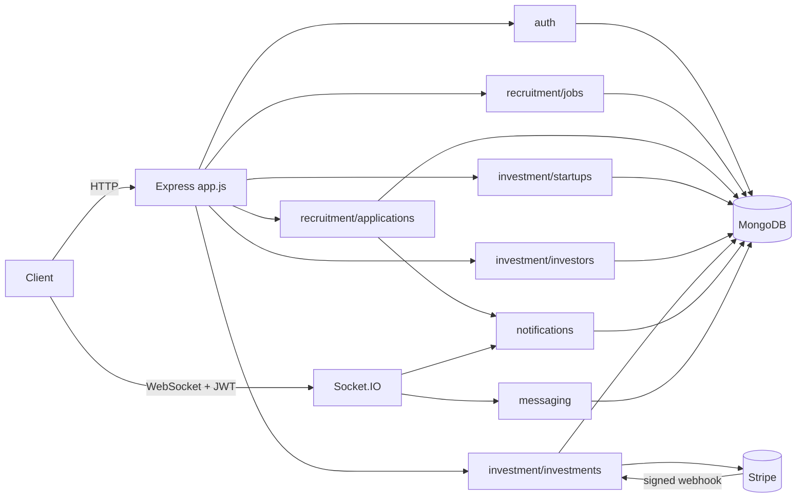
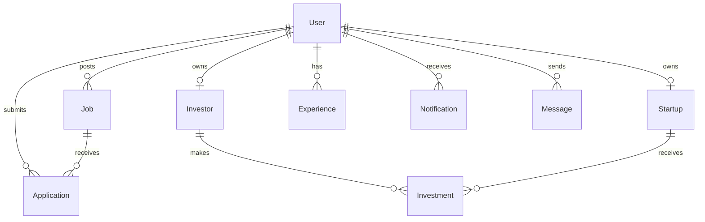

# Recruitment & Investment Platform API

[](https://github.com/mohatab/recruitment-investment-api/actions/workflows/ci.yml)

A Node.js/Express REST API for two connected products sharing one platform:

- **Recruitment** — recruiters post jobs, candidates apply with a CV, and an
  application moves through a real status lifecycle.
- **Investment** — startups publish fundraising profiles, investors save
  criteria and get matched, and an investment is a real Stripe-backed
  payment with server-verified confirmation.

Plus the cross-cutting pieces a platform like this needs: JWT auth with
refresh-token rotation, role-based authorization, real-time notifications
and messaging over Socket.IO, and Swagger/OpenAPI docs generated from the
route annotations.

## Problem statement / origin

This started as three unrelated student mini-projects (recruitment, investor/
startup management, notifications) glued into one Express app, each with its
own `User` model and its own JWT scheme. `AUDIT.md` is the full record of
that state — including confirmed critical bugs (a hardcoded JWT secret, a
password-reset path that stored plaintext passwords, an unauthenticated
Socket.IO layer that let any client join any user's private room) — and the
rationale behind every structural decision below. This README describes the
result of fixing that; `AUDIT.md` describes what was actually wrong and why.

## Features

- JWT auth (access + rotating refresh tokens), role-based authorization
  (`candidate` / `recruiter` / `investor` / `startup` / `admin`)
- Job posting, search/filtering/pagination, and a full application lifecycle
  with enforced status transitions and duplicate-application prevention
- Startup fundraising profiles, investor criteria, and a matching endpoint
- Stripe-backed investments with a **signature-verified webhook** — payment
  state is never trusted from the client
- Real-time notifications and authenticated direct messaging over Socket.IO
- CV/image uploads with MIME + extension validation, pluggable storage
  (local disk for dev, S3-compatible for production)
- Centralized error handling, structured logging, rate limiting, Helmet,
  Mongo-injection sanitization, request correlation IDs
- Swagger/OpenAPI docs at `/api-docs`

## Architecture

```
src/
  app.js, server.js        Express app assembly + HTTP/Socket.IO bootstrap
  config/                  env loading + validation, MongoDB connection
  common/                  middleware, errors, utils, storage abstraction — shared by every module
  docs/swagger.js          OpenAPI spec generation
  realtime/                Socket.IO auth, room/presence management
  modules/
    auth/                  register/login/refresh/logout, password reset
    users/                 profile, password change, CV upload
    recruitment/
      jobs/                job postings
      applications/        applications, status lifecycle
    investment/
      startups/            fundraising profiles, success-assessment heuristic
      investors/           investor profiles + criteria, matching
      investments/         Stripe-backed investments
    payments/              Stripe client + webhook handler
    notifications/         in-app notifications
    messaging/             direct messages
    experience/            candidate work history
    contact/               public contact form
    health/                liveness/readiness check
```

Each module is self-contained: `*.routes.js` → `*.controller.js` →
`*.service.js` (business logic + authorization checks) → `*.model.js`
(Mongoose schema) → `*.validation.js` (Joi schemas). Routes never touch
Mongoose directly.



## Tech stack

Node.js / Express · MongoDB + Mongoose · Socket.IO · JWT + bcryptjs · Stripe
· Multer (+ optional S3 via `@aws-sdk/client-s3`) · Joi · Jest + Supertest +
`mongodb-memory-server` · swagger-jsdoc/swagger-ui-express · Docker.

## Authentication & roles

- **Access tokens**: short-lived JWTs (`JWT_ACCESS_EXPIRES_IN`, default
  `15m`), sent as `Authorization: Bearer <token>`.
- **Refresh tokens**: opaque random strings, stored **hashed** server-side,
  rotated on every use (`POST /api/auth/refresh` revokes the old one and
  issues a new pair — reusing a rotated token is rejected).
- **Roles** (`candidate`, `recruiter`, `investor`, `startup`, `admin`) are
  read only from the verified JWT payload — never from the request body, so
  a client can't grant itself a different role. `admin` cannot be
  self-registered; it's provisioned directly in the database.
- Password reset tokens are single-use, expire after 1 hour (enforced by a
  MongoDB TTL index, not just application logic), and resetting a password
  revokes every outstanding refresh token for that account.

| Role      | Can do                                                               |
| --------- | -------------------------------------------------------------------- |
| candidate | apply to jobs, manage own profile/experience/CV                      |
| recruiter | post/manage jobs, review & move applications through their lifecycle |
| startup   | manage one fundraising profile, view investments received            |
| investor  | manage criteria, browse/match startups, create investments           |
| admin     | list users, broadcast notifications                                  |

## API documentation

Interactive docs at `/api-docs` when the app is running (generated from the
route JSDoc annotations, so it can't describe an endpoint that doesn't
exist). Every endpoint documents its auth requirement, request/response
shape, and error responses.

### Response envelope

```json
{ "success": true, "data": {}, "message": "..." }
```

```json
{ "success": false, "error": { "code": "VALIDATION_ERROR", "message": "..." } }
```

List endpoints add a `meta` block: `{ "page": 1, "limit": 20, "total": 42, "totalPages": 3 }`.

### Key flows

**Register → apply to a job**

```
POST /api/auth/register  { firstName, lastName, email, password, role: "candidate" }
POST /api/users/me/cv    multipart/form-data, field "cv"
POST /api/jobs/:jobId/applications  { coverLetter }   # uses the on-file CV if resumeUrl is omitted
```

**Recruiter reviews an application**

```
GET   /api/jobs/:jobId/applications          # owning recruiter only
PATCH /api/applications/:id/status  { "status": "under_review" }
```

Valid transitions: `submitted → under_review → shortlisted → interview →
accepted`, with `rejected` reachable from any non-terminal state. Skipping a
step (e.g. `submitted → accepted`) is rejected with `400`.

**Investor invests in a startup**

```
PUT  /api/investors/me  { criteria: { minInvestment, maxInvestment, industries, stages } }
GET  /api/startups/matches                       # startups matching saved criteria
POST /api/investments  { startupId, amount }     # -> { investment, clientSecret }
```

The client confirms payment with Stripe.js using `clientSecret`. The
investment is only marked `paid` — and the startup's `raisedSoFar`
incremented — when Stripe's **signed** webhook confirms it
(`POST /api/payments/webhook`), never from a client-reported "success".

## Setup

```bash
git clone https://github.com/mohatab/recruitment-investment-api.git
cd recruitment-investment-api
npm install
cp .env.example .env   # fill in real values — see below
npm run dev             # nodemon, or: npm start
```

Runs at `http://localhost:3000`; Swagger UI at `/api-docs`; health check at
`/health`.

### Environment variables

See [`.env.example`](./.env.example) for the full list with descriptions.
The app validates `JWT_ACCESS_SECRET`, `JWT_REFRESH_SECRET`, and
`MONGODB_URI` at startup and **refuses to boot** if any are missing — no
insecure default secret exists to fall back to.

### Docker

```bash
cp .env.example .env   # set JWT_ACCESS_SECRET / JWT_REFRESH_SECRET at minimum
docker compose up --build
```

Starts the API (port 3000) and MongoDB (port 27017), with a container
`HEALTHCHECK` hitting `/health`.

## Testing

```bash
npm test              # unit + integration, against an in-memory MongoDB
npm run test:coverage # same, with coverage report
```

Integration tests spin up `mongodb-memory-server` (no external database
needed) and exercise real request/response cycles with Supertest, covering:
registration/login/refresh/logout, role-based authorization boundaries,
job/application CRUD and the status state machine, duplicate-application
prevention, startup/investor profiles and matching, notification ownership,
and the full password-reset flow (including single-use enforcement). Unit
tests cover pure logic: JWT signing/verification, the application status
transition table, pagination parsing, and the success-assessment heuristic.

## CI/CD

`.github/workflows/ci.yml` runs on every push/PR: install → lint → format
check → test with coverage → `npm audit` (informational) → Docker build.

## Security

See `AUDIT.md` for the full list of vulnerabilities found in the original
codebase and how each was fixed. Current posture:

- Helmet security headers, CORS allowlist, `express-mongo-sanitize` against
  NoSQL operator injection, `express-rate-limit` (tighter on auth routes)
- Centralized error handler — stack traces never reach the client in
  production; unrecognized errors return a generic message
- Passwords hashed with bcrypt in a single shared `User` model; password
  hashes are never serialized in any API response (`select: false` +
  `toJSON` override)
- File uploads: MIME + extension allowlist, 5MB limit, server-generated
  filenames (client filenames are never used as a path)
- Stripe: server never touches raw card numbers; payment confirmation is
  driven by a signature-verified webhook, not client input
- One known accepted residual risk: a moderate `qs` advisory transitive
  through Express 4's own `body-parser` dependency, with no non-breaking
  fix available upstream as of this writing (an Express 5 migration would
  resolve it — tracked as a future improvement, not silently ignored).

## Database design

One `User` collection is the single identity source (replacing four
duplicate per-module user schemas in the original code). Every domain model
carries a real foreign key to the user that owns it:



`Application` has a unique compound index on `(job, applicant)` — duplicate
applications are rejected at the database level, not just checked-then-
inserted in application code.

## Deployment

Not currently deployed. `docker-compose.yml` is a local/staging reference;
for production, point `MONGODB_URI` at a managed MongoDB instance, set
`STORAGE_DRIVER=s3`, and put the container behind a TLS-terminating proxy.

## Future improvements

- Migrate to Express 5 to close the one remaining moderate dependency
  advisory (see Security)
- Horizontal scaling for Socket.IO would need a shared adapter (Redis) for
  the in-memory presence map — noted at the point it's implemented
  (`src/realtime/presence.js`)
- Admin-side moderation tooling for the contact form / broadcasts
- E2E browser tests are not included; API-level integration tests are

## License

MIT — see [`LICENSE`](./LICENSE).
