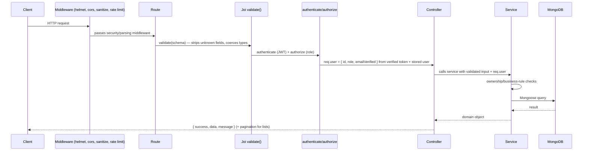
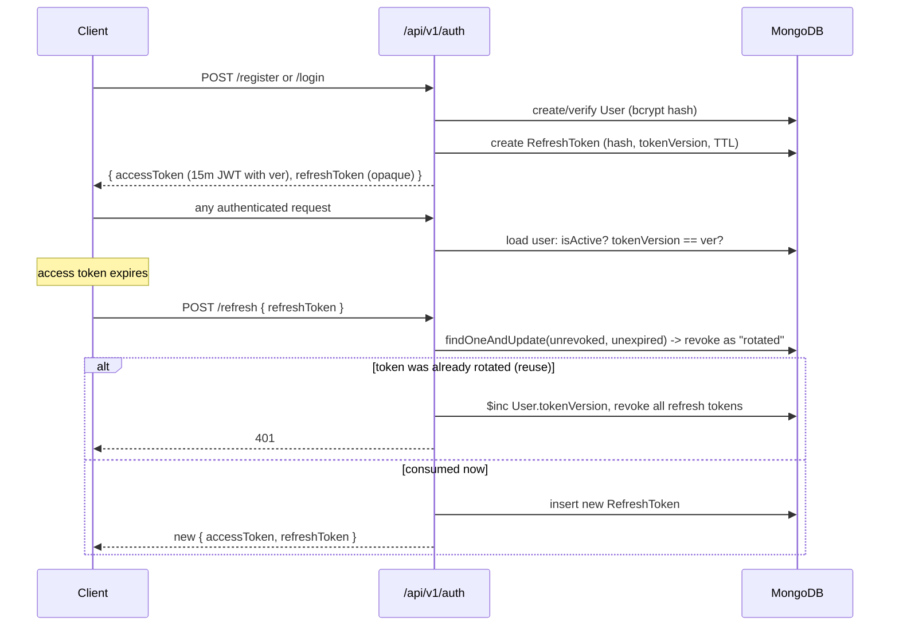
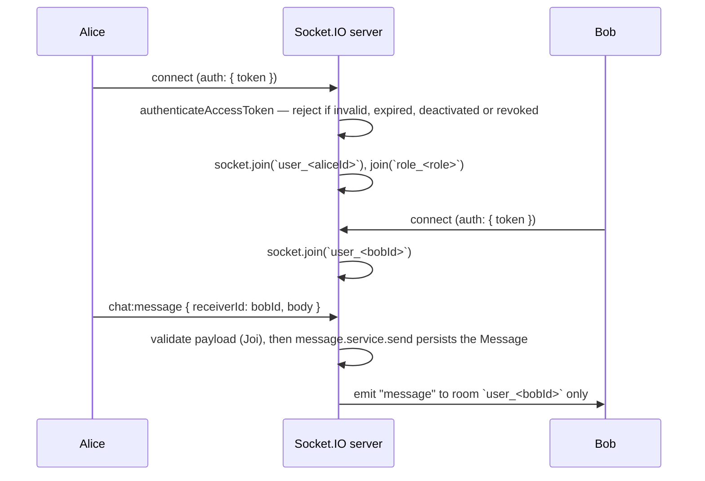
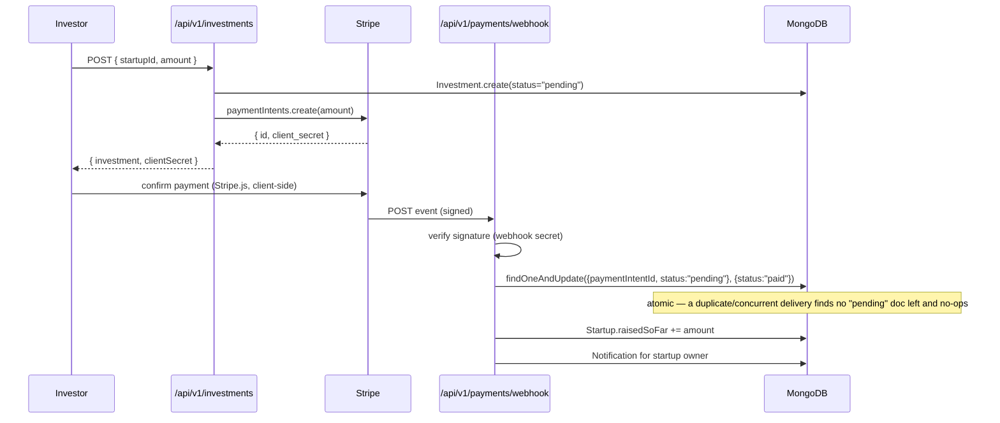

# Architecture

## Module structure

Every domain lives under `src/modules/<name>/` with the same internal
shape: `*.routes.js → *.controller.js → *.service.js → *.model.js`, plus
`*.validation.js` for its Joi schemas. Routes never call Mongoose directly;
controllers never contain business logic; authorization checks
(ownership, role) live in the service layer next to the query they guard,
not scattered across middleware.

```
src/
  app.js            Express app: middleware pipeline + route mounting (no server binding)
  server.js         HTTP server + Socket.IO bootstrap, graceful shutdown, process-level error handlers
  config/           env loading/validation, MongoDB connection
  common/           middleware, errors, utils, storage — shared by every module, owned by none
  docs/swagger.js   OpenAPI spec generated from route JSDoc
  realtime/         Socket.IO auth + connection handling, in-memory presence
  modules/          one folder per domain (see README's Architecture section for the full list)
```

`common/` is deliberately the only cross-module dependency. Modules do not
import each other's internals — where one domain needs another's data
(applications need jobs, investments need startups), it imports that
module's `*.service.js`, the same interface any route would use.

## Request lifecycle



Errors at any stage (`throw new AppError(...)`, a Mongoose `ValidationError`/
`CastError`/duplicate-key error, or an unexpected exception) are all caught
by `asyncHandler` and routed to the single centralized `errorHandler` —
see [Error handling](#error-handling) below.

## Authentication flow



- **Access token**: JWT (`sub`, `role`, `ver`, `exp`), HS256 pinned. The
  signature proves authenticity, and one indexed lookup of the user
  (`auth.service.authenticateAccessToken`, shared by HTTP and Socket.IO) checks
  that the account is active and that `ver` equals `User.tokenVersion`.
  Deactivation and session revocation therefore apply on the next request,
  not after the token expires.
- **Refresh token**: an opaque random value, stored as a hash, single use.
  Consumption is one conditional `findOneAndUpdate`. A token that was already
  _rotated_ being presented again means two parties hold it; since the
  legitimate one can't be identified, all of the user's sessions are revoked.
  Each refresh token also records the `tokenVersion` it was issued under, so a
  token issued concurrently with a revocation is still unusable.
- **`revokeAllSessions`** = `$inc tokenVersion` + revoke stored refresh tokens +
  disconnect the user's sockets. It is used by password change and reset,
  admin deactivation, logout-all, and refresh-token reuse.
- **One-time email tokens** (`AuthToken`, purposes `password_reset` and
  `email_verification`): hashed, TTL-expired, consumed atomically, and
  superseded when a newer one is issued. Forgot-password does its work after
  responding.

## Authorization

Four layers, each a single place in the code: `authenticate` (session, 401),
`authorize(...roles)` (stored role, 403), `requireVerifiedEmail` (403), and
resource checks in services — `assertOwner` (`common/utils/assertOwner.js`) or
a query filter scoped to the caller (e.g. `{ investor: req.user.id }`,
conditional updates whose filter _is_ the rule, as in notification
`markRead`). Ownership fields are never accepted from the request; services
set them from `req.user`.

The per-route policy is declared in the OpenAPI spec (`security`,
`x-required-roles`, `x-requires-verified-email`) and enforced in both
directions by tests (contract test against the routers, matrix test against
the running app). The full rule table is in [SECURITY.md](./SECURITY.md#authorization).

## Real-time (Socket.IO)



Every client event is registered through `onEvent` (`realtime/socket.js`),
which validates the payload with the same Joi schema as the matching REST
endpoint, awaits the handler inside `try/catch`, logs unexpected failures and
answers through the ack (`{ ok: true, data }` or `{ ok: false, error: { code, message } }`).
A throw or rejection escaping a Socket.IO listener becomes an unhandled
rejection, which terminates the process — a malformed `chat:message` did
exactly that before (audit C1). A socket is disconnected when its access
token expires or when the user's sessions are revoked.

Every room a socket can join is derived from its own verified identity at
connect time — never from an event payload. There is no event that takes a
raw room name or another user's id and joins the caller to it. This is the
direct fix for the original codebase's vulnerability (`AUDIT.md` #6/#7):
`joinUserRoom` there trusted a client-supplied `userId`.

Presence events go only to the user's conversation partners
(`message.service.conversationPartners`), and only on real transitions (first
socket online, last socket offline).

Presence (`realtime/presence.js`) is an in-memory `Map`, not a persisted
collection — it's ephemeral by nature and doesn't need to survive a
restart or be queried. This is a single-process design; scaling to more
than one Node process would need a shared store (Redis) for presence and
Socket.IO's Redis adapter for cross-process room delivery — noted at the
point it would matter, not built speculatively.

## Payment / webhook flow



Two deliberate choices here, both because a payment workflow gets this
wrong easily elsewhere:

1. **The server never sees a raw card number.** It creates a PaymentIntent
   and hands the client a `client_secret`; Stripe.js/Elements handles card
   data entirely client-side.
2. **Payment state changes only on a signature-verified webhook**, never on
   a client's "it succeeded" callback — a client can lie or the callback
   can simply never fire (closed tab, network drop); the webhook is the
   only source of truth Stripe itself guarantees will eventually arrive.
3. **The pending→paid transition is the atomic operation**
   (`findOneAndUpdate` filtered on the _old_ status), not a
   read-then-check-then-write — Stripe redelivers webhooks, and a
   read-then-write version of this check has a real race under concurrent
   delivery (see `investment.service.js` for the full comment).

## API contract

- **Versioning**: all application routes are mounted under `/api/v1` in
  `app.js`; `/health` and `/health/ready` stay outside it because probes are
  infrastructure, not product API.
- **Success**: `{ success, data, message }` from `common/utils/response.js`
  (`ok` / `created` / `paginated` / `noContent`). Lists add `pagination`.
  Deletes are `204` with no body. The Stripe webhook is deliberately outside
  the envelope — Stripe defines that response.
- **Errors**: `{ success: false, error: { code, message, details? }, requestId }`.
  Codes are stable strings in `common/errors/errorCodes.js`. 400 means the
  request was malformed; **422 means it was well-formed but a business rule
  refused it** (`UnprocessableEntityError`), which lets a client tell "fix your
  input" from "the domain says no".
- **Pagination**: `common/utils/pagination.js` provides both the parser and the
  Joi fragment (`listQuery`) used by every list endpoint, including the sort
  allowlist.

## Error handling

One centralized handler (`common/middleware/errorHandler.js`) turns every
error into the same response shape. `normalize()` maps known failure
shapes — a thrown `AppError` subclass, a Mongoose `ValidationError`,
`CastError`, or duplicate-key error, a Multer file-upload error, a body-parser
failure (malformed JSON → `400 INVALID_JSON`, oversized body →
`413 PAYLOAD_TOO_LARGE`) — to a `{statusCode, code, message}` triple;
anything unrecognized becomes a generic `500 INTERNAL_ERROR` with no stack
trace or internal detail sent to the client. Every error body includes the
`requestId`. Rate-limit rejections (`429 TOO_MANY_REQUESTS`) go through the
same handler.

## Logging and request correlation

- `requestId` middleware reuses a client/proxy `X-Request-Id` only if it
  matches `[A-Za-z0-9._:-]{1,128}`; otherwise it generates a UUID. The id is
  echoed in the response header and in error bodies.
- `requestLogger` writes one JSON line per request when the response
  finishes: `requestId`, `method`, `path` (no query string), matched
  `route`, `status`, `durationMs`, `userId` and `errorCode`. Level: `info`
  for 2xx/3xx, `warn` for 4xx, `error` for 5xx. Health probes log at `debug`
  (`warn` when not ready).
- Headers, query strings and bodies are never logged. Only 5xx errors produce
  an extra `error` entry with a stack (stack omitted in production).

## Why layered instead of a simpler flat structure

A CRUD-only API could get away with routes calling Mongoose directly. This
one has real cross-cutting rules — an application can't skip a status, an
investor can't invest below a startup's minimum, a webhook must be
idempotent — that don't belong in a route handler and get copy-pasted if
they're not centralized. The service layer is where those rules live
exactly once. It's also what makes the unit tests for the status
transition table and the success-assessment heuristic possible without
an HTTP layer or a database at all.
