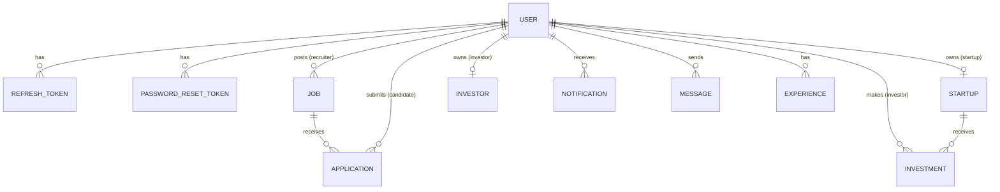

# Project Audit — Recruitment & Investment API

|            |                                                                                                                                                                                                                                                                                                                                                                          |
| ---------- | ------------------------------------------------------------------------------------------------------------------------------------------------------------------------------------------------------------------------------------------------------------------------------------------------------------------------------------------------------------------------ |
| Audit date | 2026-09-17                                                                                                                                                                                                                                                                                                                                                               |
| Scope      | Working tree on `master`: HEAD `ea636a6` plus 42 uncommitted changes (33 modified and 9 untracked paths)                                                                                                                                                                                                                                                                 |
| Method     | I read every file in `src/`, `test/` and the config, CI, Docker and docs files. Every defect marked **(verified)** was reproduced by running code: a temporary Jest probe against the real app and in-memory MongoDB, a script against the real `src/server.js` entrypoint, and a standalone `express-rate-limit` reproduction. The probe files were deleted afterwards. |
| Phase      | **Task 1: audit and baseline only.** No application code was changed.                                                                                                                                                                                                                                                                                                    |

---

## 0. Context: this is the second rebuild

The history matters for how this audit should be read:

1. **`417d982`** is the original project. It was three unrelated mini-APIs named after their authors (`mahmoud/`, `matrix/`, `mohamed/`), each with its own `User` model and JWT scheme. It had a hardcoded `"secret"` JWT key, a password reset that saved plaintext passwords, and an unauthenticated Socket.IO layer. `AUDIT.md` (repo root) documents that state and is accurate for that commit.
2. **`ea636a6`** was a rebuild into `src/modules/*` with layers (routes → controller → service → model), one `User` model, JWT with refresh tokens, Joi validation, Stripe webhooks, Docker and CI. `FINAL_AUDIT.md` describes it.
3. **The uncommitted working tree** continues that rebuild: ReDoS escaping, a Swagger contract test, a socket test, a webhook test, contact and experience tests, and README and docs rewrites.

The author-named modules (`mahmoud`, `matrix`, `mohamed`) **no longer exist**. The main structural goals of this brief are already largely in place. So this audit does not recommend another rewrite. It measures the current code against production standards, and it finds that several claims in `FINAL_AUDIT.md` and `docs/SECURITY.md` do not hold up under testing (see §6 and §14).

### Baseline (measured 2026-09-17, Node 20.18.0, npm 10.8.2)

| Check                         | Result                                                                        |
| ----------------------------- | ----------------------------------------------------------------------------- |
| `npm run lint`                | 0 errors, 0 warnings                                                          |
| `npm run format:check`        | passes                                                                        |
| `npm run test:coverage`       | **20 suites, 95 tests, 95 passing, 0 failing** (about 63 s)                   |
| Coverage                      | Statements 88.0% · Branches 65.4% · Functions 80.6% · Lines 90.4%             |
| `npm audit --omit=dev`        | 3 moderate (`qs`, pulled in by `express@4` → `body-parser`)                   |
| Circular `require`s in `src/` | none (checked with a script over the require graph)                           |
| Git remote                    | **none configured** locally, so GitHub Actions results could not be inspected |

---

## 1. Architecture

### 1.1 Current architecture

```
src/
├── app.js            Express app: middleware, route mounting, error handler
├── server.js         HTTP + Socket.IO bootstrap, graceful shutdown, process handlers
├── config/           env.js (env loading + partial validation), database.js
├── common/
│   ├── constants/    roles
│   ├── errors/       AppError hierarchy
│   ├── middleware/   auth (authenticate/authorize), errorHandler, rateLimiter,
│   │                 requestId, upload (multer), validate (Joi)
│   ├── services/     email.service (nodemailer)
│   ├── storage/      local + S3 drivers behind one interface
│   └── utils/        asyncHandler, escapeRegex, logger, pagination, response
├── docs/swagger.js   swagger-jsdoc spec built from route JSDoc
├── modules/
│   ├── auth/         register/login/refresh/logout/forgot/reset; RefreshToken, PasswordResetToken models
│   ├── users/        User model, /me profile, CV upload, admin list
│   ├── recruitment/  jobs/, applications/ (two routers: nested + "top")
│   ├── investment/   startups/, investors/, investments/
│   ├── payments/     Stripe adapter + webhook route
│   ├── notifications/
│   ├── messaging/
│   ├── experience/   work-history entries
│   ├── contact/      public contact form
│   └── health/
└── realtime/         socket.js (handshake auth + chat event), presence (in-memory), ioRegistry
```

Most modules follow a consistent **routes → controller → service → model** layering, and controllers are generally thin. That foundation is sound and is worth keeping.

### 1.2 Architectural problems

| #   | Problem                                                                                                                                                                                                                                                                 | Evidence                                                                          |
| --- | ----------------------------------------------------------------------------------------------------------------------------------------------------------------------------------------------------------------------------------------------------------------------- | --------------------------------------------------------------------------------- |
| A1  | **Duplicated chat business logic.** The `chat:message` socket handler persists messages itself instead of calling `message.service.send`. The two paths differ: no `delivered` flag, no validation, different error handling.                                           | `src/realtime/socket.js:35-50` vs `src/modules/messaging/message.service.js:5-19` |
| A2  | **Token parsing is implemented three times**: `authenticate`, `optionalAuthenticate` and `authenticateSocket`. Because of this, fixes such as the account-status check never reach all three.                                                                           | `common/middleware/auth.js`, `realtime/socket.js`                                 |
| A3  | **Inverted dependency**: `common/middleware/auth.js` requires `modules/auth/jwt.js`, so shared infrastructure depends on a feature module.                                                                                                                              | `common/middleware/auth.js:1`                                                     |
| A4  | **Inconsistent module layout**: `recruitment/` and `investment/` nest sub-modules, while `payments/`, `messaging/` and `notifications/` are flat. Applications need two routers (`application.routes.js` and the awkwardly named `applications.top.routes.js`).         | `modules/recruitment/applications/`                                               |
| A5  | **Side effects are not isolated from writes.** Notifications (DB write + socket emit) run inline after the main write. If a notification fails, the client gets a 500 even though the application or status change was already committed, and a retry then returns 409. | `application.service.js:35,86`, `investment.service.js:54`                        |
| A6  | **Business logic in controllers**: the upload-to-storage flow lives in `user.controller.uploadCv` and `contact.controller.create`.                                                                                                                                      | those files                                                                       |
| A7  | **Investment doubles as the payment record.** There is no payment/transaction entity, no record of Stripe events, and no refund record. Status and the `raisedSoFar` counter are updated in separate non-transactional writes.                                          | `investment.service.js`                                                           |
| A8  | **Domain services emit socket events directly** through a global registry (`getIO()`). This works, but it couples domain code to the transport.                                                                                                                         | `notification.service.js`, `message.service.js`                                   |

### 1.3 Dead code

| Item                                                                               | Location                       |
| ---------------------------------------------------------------------------------- | ------------------------------ |
| `optionalAuthenticate` is defined and exported but never used                      | `common/middleware/auth.js:21` |
| `startupService.assertOwnership` is exported but never called                      | `startup.service.js:70`        |
| `storage.remove` (both drivers) is never called, so replaced CVs are never deleted | `common/storage/*.js`          |
| `stripe` client export is unused outside the service                               | `stripe.service.js:31`         |
| `jobService.assertOwnership` is exported but only used internally                  | `job.service.js:51`            |

### 1.4 Naming

- There is no `/api/v1` version prefix.
- `applications.top.routes.js` is an unclear name.
- The error code for business-rule failures is `VALIDATION_ERROR` (for example "job closed" or "minimum investment"). These are not input validation errors.
- `Job.role` means a job category, which is easy to confuse with the user `role`.
- `Message.roomId` is a derived pair key, not a Socket.IO room that anyone joins.

---

## 2. API inventory

**46 routes plus `/api-docs` plus static `/uploads/*`.** Conventions in the current code:

- Success envelope: `{success, data, message}`
- Lists: `{success, data, meta, message}`
- Errors: `{success:false, error:{code, message, details?}}`, **without a `requestId`**
- Validation: Joi via `validate()`, with `stripUnknown: true`
- Auth: `Authorization: Bearer <JWT>`

"Valid." means the Joi schema in the module's `*.validation.js`. "—" means none.

### 2.1 Health, docs, static

| Method | Path         | Auth | Validation | Behavior                                | Problems → recommendation                                                                                                                                                                                 |
| ------ | ------------ | ---- | ---------- | --------------------------------------- | --------------------------------------------------------------------------------------------------------------------------------------------------------------------------------------------------------- |
| GET    | `/health`    | —    | —          | 200 if Mongo `readyState===1`, else 503 | Mixes liveness and readiness. The Docker `HEALTHCHECK` uses it, so a Mongo outage marks the container unhealthy and restarts it. → split into `/health` (process alive) and `/health/ready` (Mongo ping). |
| GET    | `/api-docs`  | —    | —          | Swagger UI                              | Keep.                                                                                                                                                                                                     |
| GET    | `/uploads/*` | —    | —          | `express.static` over the upload dir    | **CVs (PII) are public to anyone with the URL** (verified). → authenticated, authorized download endpoint.                                                                                                |

### 2.2 Auth: `/api/auth` (router-wide `authLimiter`, 20 requests / 15 min / IP)

| Method | Path               | Purpose              | Body                                                                                                   | Response                                | Errors                | Problems → recommendation                                                                                                                                                                                                                                      |
| ------ | ------------------ | -------------------- | ------------------------------------------------------------------------------------------------------ | --------------------------------------- | --------------------- | -------------------------------------------------------------------------------------------------------------------------------------------------------------------------------------------------------------------------------------------------------------- |
| POST   | `/register`        | Create account       | firstName, lastName, email, password (6–128), role ∈ {candidate, recruiter, investor, startup}, phone? | 201 `{user, accessToken, refreshToken}` | 400, 409 email exists | Password minimum of 6 is weak. The 409 reveals whether an email is registered. No email verification.                                                                                                                                                          |
| POST   | `/login`           | Authenticate         | email, password                                                                                        | 200 `{user, tokens}`                    | 401                   | **Deactivated users can log in** (verified). A missing user skips bcrypt, which creates a timing oracle. No per-account lockout.                                                                                                                               |
| POST   | `/refresh`         | Rotate refresh token | refreshToken                                                                                           | 200 new pair                            | 401                   | **The rotation is not atomic**: two concurrent calls with the same token both succeed (verified). **No reuse detection**: replaying a revoked token does not revoke the token family (verified).                                                               |
| POST   | `/logout`          | Revoke refresh token | refreshToken                                                                                           | 200 always                              | 400                   | The access token stays valid until it expires. Acceptable if documented.                                                                                                                                                                                       |
| POST   | `/forgot-password` | Email reset link     | email                                                                                                  | 200 always                              | 400                   | The email is sent with `await` **only when the user exists**, so response time reveals registered emails. The link points to `${BASE_URL}/reset-password`, which is **not a route**: the API only has `POST /reset-password`, so the emailed link returns 404. |
| POST   | `/reset-password`  | Consume reset token  | token, password (6–128)                                                                                | 200                                     | 401                   | Mark-as-used is not atomic, so there is a double-spend race. Does not verify the email.                                                                                                                                                                        |

Missing: email verification, resend-verification, `GET /auth/me` (currently `/users/me`), and logout-all-sessions.

### 2.3 Users: `/api/users` (all routes `authenticate`)

| Method | Path           | AuthZ                  | Valid.                          | Response                                   | Problems → recommendation                                                                                                                                                                                         |
| ------ | -------------- | ---------------------- | ------------------------------- | ------------------------------------------ | ----------------------------------------------------------------------------------------------------------------------------------------------------------------------------------------------------------------- |
| GET    | `/me`          | self                   | —                               | 200 full profile                           | Works for a deactivated user (verified).                                                                                                                                                                          |
| PATCH  | `/me`          | self                   | allow-listed fields, min 1      | 200                                        | OK (no mass assignment of role, email or password).                                                                                                                                                               |
| POST   | `/me/password` | self                   | currentPassword, newPassword    | 200                                        | **Existing access and refresh tokens stay valid after a password change** (verified: both 200). → revoke refresh tokens and add a `tokenVersion` check.                                                           |
| POST   | `/me/cv`       | self                   | multer: ext + client MIME, 5 MB | 200 `user`                                 | Magic bytes are not checked, so a non-PDF with a `.pdf` name and MIME is accepted (verified). A missing file returns **404** instead of 400 (verified). The old CV is never deleted. The file is served publicly. |
| GET    | `/`            | admin                  | **no query validation**         | 200 paginated                              | `sort` is not allow-listed.                                                                                                                                                                                       |
| GET    | `/:id`         | any authenticated user | —                               | 200 {firstName, lastName, role, createdAt} | No ObjectId validation (falls through to CastError → 400). Acceptable.                                                                                                                                            |

Missing: admin deactivate/reactivate. `isActive` exists, but nothing sets it and nothing enforces it.

### 2.4 Jobs: `/api/jobs`

| Method | Path   | AuthN/Z           | Valid.         | Response      | Problems → recommendation                                                                                                                                                                                                                                                       |
| ------ | ------ | ----------------- | -------------- | ------------- | ------------------------------------------------------------------------------------------------------------------------------------------------------------------------------------------------------------------------------------------------------------------------------- |
| GET    | `/`    | public            | `list` (query) | 200 paginated | **`sort` is not allow-listed**: `?sort=$where` returns **500** (verified). **Expired jobs are still listed as open** (verified). Any unindexed field can be sorted on.                                                                                                          |
| GET    | `/:id` | public            | —              | 200           | Closed and expired jobs are visible. Acceptable.                                                                                                                                                                                                                                |
| POST   | `/`    | recruiter         | `create`       | 201           | `applyLink`/`applyEmail` are not required when `applyMethod=external`.                                                                                                                                                                                                          |
| PATCH  | `/:id` | recruiter + owner | `update`       | 200           | **A PATCH containing only `maxSalary` is always rejected** because Joi's `ref('minSalary')` needs the sibling field (verified, even valid values fail). A PATCH with only `minSalary` can push min above the stored max. Status can move from closed back to open with no rule. |
| DELETE | `/:id` | recruiter + owner | —              | 200           | **Hard delete leaves applications pointing at a missing job** (verified: `/applications/mine` returns `job: null`). → soft-close, or block delete when applications exist. Should return 204.                                                                                   |

Missing: a recruiter's own jobs, including closed ones (`GET /jobs/mine`). A recruiter currently cannot list their closed postings at all.

### 2.5 Applications

| Method | Path                            | AuthN/Z               | Valid.                             | Response      | Problems → recommendation                                                                                                                                                                                                                       |
| ------ | ------------------------------- | --------------------- | ---------------------------------- | ------------- | ----------------------------------------------------------------------------------------------------------------------------------------------------------------------------------------------------------------------------------------------- |
| POST   | `/api/jobs/:jobId/applications` | candidate             | coverLetter ≥ 10, resumeUrl? (uri) | 201           | **Applying to an expired job succeeds** (verified). **`resumeUrl` accepts `javascript:alert(1)`** (verified), a stored XSS vector for any recruiter UI. A notification failure after the insert returns 500 (A5). No max length on coverLetter. |
| GET    | `/api/jobs/:jobId/applications` | recruiter + job owner | **no query validation**            | 200 paginated | `status` and `sort` are unvalidated.                                                                                                                                                                                                            |
| GET    | `/api/applications/mine`        | candidate             | —                                  | 200 paginated | Shows orphaned `job: null` entries.                                                                                                                                                                                                             |
| PATCH  | `/api/applications/:id/status`  | recruiter + job owner | status enum                        | 200           | Read, check, then save, so two concurrent transitions can both pass. → conditional update on the current status.                                                                                                                                |

Missing: `GET /applications/:id` (for the owner candidate or owning recruiter) and candidate withdrawal.

### 2.6 Startups: `/api/startups`

| Method | Path                  | AuthN/Z    | Valid.   | Response            | Problems → recommendation                                                                                             |
| ------ | --------------------- | ---------- | -------- | ------------------- | --------------------------------------------------------------------------------------------------------------------- |
| GET    | `/`                   | public     | `list`   | 200 paginated       | `sort` is not allow-listed.                                                                                           |
| POST   | `/success-assessment` | **public** | 4 fields | 200 heuristic       | Hardcoded `if` (funding > 500k && (software ‖ ads)). Stateless, not tied to any startup. **Recommend removal** (§15). |
| GET    | `/matches`            | investor   | —        | 200 **unpaginated** | Unbounded result set.                                                                                                 |
| PUT    | `/me`                 | startup    | `upsert` | 200                 | `minInvestment > totalRaising` is allowed.                                                                            |
| GET    | `/me`                 | startup    | —        | 200                 | OK.                                                                                                                   |
| GET    | `/:id`                | public     | —        | 200                 | OK.                                                                                                                   |

### 2.7 Investors: `/api/investors`

| Method | Path   | AuthN/Z                | Valid.   | Response     | Problems → recommendation                                                                                        |
| ------ | ------ | ---------------------- | -------- | ------------ | ---------------------------------------------------------------------------------------------------------------- |
| PUT    | `/me`  | investor               | `upsert` | 200          | `criteria.minInvestment > maxInvestment` is allowed. A partial `criteria` object replaces the whole subdocument. |
| GET    | `/me`  | investor               | —        | 200          | OK.                                                                                                              |
| GET    | `/:id` | any authenticated user | —        | 200 full doc | Private investment criteria are shown to every user, including startups. → public projection.                    |

### 2.8 Investments and payments

| Method | Path                          | AuthN/Z                 | Valid.                | Response                         | Problems → recommendation                                                                                                                                                                                                                                                                        |
| ------ | ----------------------------- | ----------------------- | --------------------- | -------------------------------- | ------------------------------------------------------------------------------------------------------------------------------------------------------------------------------------------------------------------------------------------------------------------------------------------------ |
| POST   | `/api/investments`            | investor                | startupId, amount ≥ 1 | 201 `{investment, clientSecret}` | **Over-funding is allowed** (5000 invested into a 1000 raise, verified). **Fractional cents are accepted** (`10.005`, verified). Money is stored as float dollars. No Stripe idempotency key. If Stripe fails, an orphaned `pending` investment with no PaymentIntent is left behind.            |
| GET    | `/api/investments/mine`       | investor                | —                     | 200 **unpaginated**              | Unbounded.                                                                                                                                                                                                                                                                                       |
| GET    | `/api/investments/startup`    | startup                 | —                     | 200 **unpaginated**              | Unbounded.                                                                                                                                                                                                                                                                                       |
| POST   | `/api/investments/:id/refund` | investor-owner or admin | —                     | 200                              | An investor can **self-refund a completed investment at any time** (a business-rule question). Not idempotent: the Stripe refund succeeds, then the DB save and the counter decrement run separately. No `charge.refunded` webhook, so refunds made in the Stripe dashboard are never reflected. |
| POST   | `/api/payments/webhook`       | Stripe signature        | raw body              | 200 / 400 / 500                  | **`payment_failed` followed by `succeeded` leaves the investment `failed` although the money was captured** (verified). The amount and currency in the event are not compared with the record. No event-ID dedup log.                                                                            |

### 2.9 Notifications: `/api/notifications` (all routes `authenticate`)

| Method | Path         | AuthN/Z                | Valid.                  | Response      | Problems → recommendation                                                                                                                                                                 |
| ------ | ------------ | ---------------------- | ----------------------- | ------------- | ----------------------------------------------------------------------------------------------------------------------------------------------------------------------------------------- |
| GET    | `/`          | self + role broadcasts | **none**                | 200 paginated | `sort` is not allow-listed. No unread filter or count.                                                                                                                                    |
| PATCH  | `/:id/read`  | "owner"                | —                       | 200           | **An investor can mark a candidate-role broadcast as read, and it then appears read for every candidate** (verified). Role broadcasts share a single `read` boolean. → per-user receipts. |
| POST   | `/broadcast` | admin                  | xor(userId, targetRole) | 200           | `userId` is not checked for existence. Should return 201.                                                                                                                                 |

Missing: mark-all-read and unread count.

### 2.10 Messages: `/api/messages` (all routes `authenticate`)

| Method | Path             | AuthN/Z                    | Valid.           | Response            | Problems → recommendation                                                                                                                                    |
| ------ | ---------------- | -------------------------- | ---------------- | ------------------- | ------------------------------------------------------------------------------------------------------------------------------------------------------------ |
| POST   | `/`              | any authenticated user     | receiverId, body | 201                 | **Messages to non-existent users and to yourself succeed. A 500 KB body is accepted** (verified). No max length.                                             |
| GET    | `/conversations` | self                       | —                | 200                 | **Loads every message the user ever sent or received into memory**, with two `populate` calls and no index on `sender`/`receiver`. → aggregation plus index. |
| GET    | `/:userId`       | participant (derived room) | —                | 200 **unpaginated** | Unbounded history. No read state.                                                                                                                            |

### 2.11 Experience and contact

| Method | Path                   | AuthN/Z       | Valid.           | Response | Problems → recommendation                                                                                                                                                    |
| ------ | ---------------------- | ------------- | ---------------- | -------- | ---------------------------------------------------------------------------------------------------------------------------------------------------------------------------- |
| POST   | `/api/experiences`     | authenticated | `create`         | 201      | No `endDate ≥ startDate` check. No update endpoint.                                                                                                                          |
| GET    | `/api/experiences`     | self          | —                | 200      | Bounded in practice. OK.                                                                                                                                                     |
| DELETE | `/api/experiences/:id` | owner         | —                | 200      | Should return 204.                                                                                                                                                           |
| POST   | `/api/contact`         | **public**    | `create` + image | 201      | Unauthenticated PII and file upload behind only the general 300/15 min limiter. **Write-only**: no endpoint reads submissions, so the data can only be seen in the database. |

---

## 3. Database

MongoDB via Mongoose 8. All schemas have `timestamps: true`. No transactions anywhere. The Docker Mongo runs standalone (no replica set), so transactions are **not currently possible** without changing the deployment.

### 3.1 Models

**User** (`users`)

| Field                           | Type / constraints                                                                                                                                |
| ------------------------------- | ------------------------------------------------------------------------------------------------------------------------------------------------- |
| firstName, lastName             | String, required, trim. **No max length at model level** (Joi: 80).                                                                               |
| email                           | String, required, **unique**, lowercase, trim, regex                                                                                              |
| password                        | String, required, minlength 6, `select:false`, bcrypt cost 10 in `pre('save')`                                                                    |
| role                            | enum candidate/recruiter/investor/startup/admin, default candidate                                                                                |
| phone, nationality              | String                                                                                                                                            |
| birthdate                       | Date                                                                                                                                              |
| location.country, location.city | String                                                                                                                                            |
| cvUrl                           | String \| null. Stores the **full public URL**, not the storage key, so storage drivers cannot be switched and the file cannot be deleted by key. |
| isActive                        | Boolean, default true. **Never enforced.**                                                                                                        |

Indexes: `email` (unique) and `role`. Missing: `emailVerifiedAt`, `tokenVersion`/`passwordChangedAt`, login-attempt tracking.

**RefreshToken**: `user` (ref, indexed), `tokenHash` (unique), `expiresAt` (TTL 0), `revokedAt`. Missing: `familyId`/`replacedBy` for reuse detection.

**PasswordResetToken**: `user` (ref, indexed), `tokenHash` (unique), `expiresAt` (TTL), `usedAt`. Older unused tokens are not invalidated when a new one is issued.

**Job**: `recruiter` (ref, indexed), title, role, description, responsibilities (required strings, **no max length**), minSalary/maxSalary (Number ≥ 0, **no cross-field check**), salaryType enum, applyMethod enum, applyLink, applyEmail, tags [String], vacancies ≥ 1, location, expirationDate (required), status enum open/closed.
Indexes: `recruiter`, text(`title`, `role`, `tags`), `{status, expirationDate}`. The default list query is `{status}` sorted by `createdAt:-1`, which **no index covers**.

**Application**: `job` (ref, indexed), `applicant` (ref, indexed), coverLetter (min 10), resumeUrl (required), status enum of 6.
Indexes: `{job, applicant}` unique (enforces one application per job per candidate), `job`, `applicant`. The single-field `job` index is **redundant** because it is a prefix of the unique compound index. The recruiter list sorts by `createdAt`, but no `{job, createdAt}` index exists.

**Startup**: `owner` (ref, **unique**, one per account), name, pitchTitle, description, website, location, industries [String], stage enum, idealInvestorRole, previousRaised, totalRaising, **raisedSoFar** (denormalized counter, ≥ 0), minInvestment.
Indexes: `owner` (unique), `{industries, stage}`. `raisedSoFar` can drift from the sum of paid investments because the updates are non-atomic (A7). There is `min: 0`, but `$inc` bypasses validators.

**Investor**: `owner` (ref, unique), profile strings and links, areasOfExpertise, numberOfInvestments (**self-reported, not derived**), companies, `criteria` {minInvestment, maxInvestment (default `MAX_SAFE_INTEGER`), industries, stages enum[], locations}.

**Investment**: `investor` (ref User, indexed), `startup` (ref, indexed), amount (Number ≥ 1, **float dollars**), currency (default usd, **no enum**), status enum pending/paid/failed/refunded, `stripePaymentIntentId` (unique, sparse).

**Notification**: message, `user` (ref \| null), `targetRole` (enum \| null), **`read` (one boolean shared by every recipient of a role broadcast)**. Indexes: `{user, createdAt}`, `{targetRole, createdAt}`. No TTL/retention.

**Message**: sender, receiver (refs, **not indexed**), roomId (sorted id pair), body (**no max length**), delivered (online at send time, which is misleading). Index: `{roomId, createdAt}`.

**Experience**: `user` (ref, indexed), jobTitle, companyName, jobCategory, experienceType, startDate, endDate, currentlyWorking. No date-order validation.

**Contact**: firstName, lastName, email, phoneNumber, country, city, profileImageUrl. No indexes, no owner, no retention.

### 3.2 Relationships



### 3.3 Data consistency issues

1. Deleting a job orphans its applications (verified).
2. Investment status and `Startup.raisedSoFar` are updated separately, so a crash in between leaves them inconsistent. Refund does the same in reverse.
3. Role-broadcast notifications have one shared read state (verified).
4. `cvUrl` and `resumeUrl` store absolute URLs built from `BASE_URL`. Changing the domain or storage driver breaks every stored link.
5. `Investor.numberOfInvestments` is user-editable and never reconciled with real `Investment` records.
6. No existence checks on `receiverId` or broadcast `userId`, so references can point at nothing (verified).
7. There are no user deletion paths yet, so cascade behavior is undefined.

---

## 4. Authentication

| Area               | Current implementation                                                    | Assessment                                                                                                                                                                                 |
| ------------------ | ------------------------------------------------------------------------- | ------------------------------------------------------------------------------------------------------------------------------------------------------------------------------------------ |
| Registration       | Joi → `findOne` → `User.create` → token pair                              | Admin self-registration correctly blocked. Min password 6. 409 reveals registered emails. No verification email.                                                                           |
| Password hashing   | bcryptjs, cost 10, `pre('save')`                                          | Correct pattern. Recommend cost 12 and a 72-byte max (bcrypt truncates longer input silently; Joi max 128 _characters_ can exceed 72 bytes).                                               |
| Login              | bcrypt compare, 401 generic message                                       | **Ignores `isActive`** (verified). Timing oracle on unknown email. IP-only rate limit, **bypassable** (§6, verified).                                                                      |
| Access token       | HS256 JWT `{sub, role}`, 15 min, algorithm pinned                         | Good. No `iss`/`aud`. Role is embedded, so a role change or deactivation takes up to 15 minutes to apply. There is **no revocation hook at all** (password change does not invalidate it). |
| Refresh token      | 80-hex random, SHA-256 hash stored, 7-day TTL, rotation                   | Good base. **Non-atomic rotation (verified race). No reuse detection (verified).** Returned in the JSON body. There is no browser client, so cookies are not required. Document it.        |
| Logout             | Revokes one refresh token                                                 | OK. No logout-all.                                                                                                                                                                         |
| Forgot/reset       | Random 32-byte token, hashed, 1 h TTL, single use, revokes refresh tokens | **Timing oracle. Broken link target (404). Non-atomic `usedAt`.**                                                                                                                          |
| Change password    | Verifies current password                                                 | **Does not revoke refresh tokens or outstanding access tokens** (verified).                                                                                                                |
| Email verification | **Not implemented**                                                       | Required by the brief.                                                                                                                                                                     |
| Current user       | `GET /api/users/me`                                                       | Works for deactivated users.                                                                                                                                                               |

---

## 5. Authorization

### 5.1 Roles (from `common/constants/roles.js`, all used by real routes)

| Role      | Can do                                                                                                                                 |
| --------- | -------------------------------------------------------------------------------------------------------------------------------------- |
| candidate | apply to jobs, list own applications, CV, experience                                                                                   |
| recruiter | CRUD own jobs, review applications for own jobs                                                                                        |
| startup   | one startup profile, view investments received                                                                                         |
| investor  | investor profile and criteria, matches, invest, refund own                                                                             |
| admin     | list users, broadcast notifications, refund any investment. **Can only be created directly in the database; there is no seed script.** |

All five roles are grounded in real workflows. No role should be added or removed.

### 5.2 Mechanism

`authorize(...roles)` compares against `req.user.role` from the verified JWT (never from the body). Ownership checks live in services (`String(doc.owner) !== String(userId)`). This is correct in principle but repeated ad hoc about 6 times, with no shared helper.

### 5.3 Findings

| #   | Finding                                                                                                                                                                                                                           | Severity                                              | Evidence      |
| --- | --------------------------------------------------------------------------------------------------------------------------------------------------------------------------------------------------------------------------------- | ----------------------------------------------------- | ------------- |
| Z1  | Any role can mark another role's broadcast as read, and it changes that notification for every recipient.                                                                                                                         | High                                                  | verified      |
| Z2  | Deactivated accounts keep full access: login, access token, refresh.                                                                                                                                                              | High                                                  | verified      |
| Z3  | Password change keeps every old session alive.                                                                                                                                                                                    | High                                                  | verified      |
| Z4  | `GET /investors/:id` returns private investment criteria to any authenticated user.                                                                                                                                               | Medium                                                | code          |
| Z5  | Uploaded CVs are public via `/uploads/*` (unguessable UUID, but no authorization at all).                                                                                                                                         | High                                                  | verified      |
| Z6  | The socket connection keeps its identity after token expiry or logout: auth is checked only at handshake.                                                                                                                         | Medium                                                | code          |
| Z7  | Any user can message any other user. There is no relationship check such as "recruiter ↔ applicant" or "investor ↔ startup". This is a product decision, but at minimum the receiver must exist and there should be abuse limits. | Medium                                                | verified      |
| Z8  | Investors can self-refund at any time. Whether a refund needs admin approval is a **business decision** (see §15 decision D3).                                                                                                    | Medium                                                | code          |
| —   | IDOR on jobs, applications, experience, notifications (personal), messages and investments                                                                                                                                        | **Not found.** Ownership checks exist and are tested. | tests + probe |
| —   | Privilege escalation through registration or profile update                                                                                                                                                                       | **Not found.** `role` is not writable.                | tests         |

---

## 6. Security

| Control             | State                                                                                                                                      | Finding                                                                                                                                                                                                                                                                                                                                                                                                               |
| ------------------- | ------------------------------------------------------------------------------------------------------------------------------------------ | --------------------------------------------------------------------------------------------------------------------------------------------------------------------------------------------------------------------------------------------------------------------------------------------------------------------------------------------------------------------------------------------------------------------- |
| Helmet              | `helmet()` defaults                                                                                                                        | OK.                                                                                                                                                                                                                                                                                                                                                                                                                   |
| CORS                | `origin: env.corsOrigin`, **default `*`** in both code and `.env.example`                                                                  | The brief requires a restrictive default. → required allow-list in production.                                                                                                                                                                                                                                                                                                                                        |
| Trust proxy         | Hardcoded `app.set("trust proxy", 1)`                                                                                                      | **Critical in combination with the Docker setup:** compose publishes port 3000 directly, so clients control `X-Forwarded-For`. **Every rate limiter, including auth brute-force protection, can be bypassed by rotating that header** (verified: 6 of 6 requests passed a limit of 2). → make `TRUST_PROXY` configurable, default off.                                                                                |
| Rate limiting       | Global 300 / 15 min, auth 20 / 15 min, memory store, **disabled when `NODE_ENV=test`**                                                     | Per-process only. No limits on socket events, the contact form, messages or uploads.                                                                                                                                                                                                                                                                                                                                  |
| Body limits         | `express.json({limit:"1mb"})`                                                                                                              | **An oversized body returns 500 `INTERNAL_ERROR` instead of 413** (verified).                                                                                                                                                                                                                                                                                                                                         |
| Malformed JSON      | —                                                                                                                                          | **Returns 500 instead of 400** (verified), and is logged as an error with a stack trace.                                                                                                                                                                                                                                                                                                                              |
| NoSQL injection     | `express-mongo-sanitize` + Joi                                                                                                             | Keys are sanitized, but **values in `sort` are not**: `?sort=$where` returns 500 (verified).                                                                                                                                                                                                                                                                                                                          |
| ReDoS               | `escapeRegex` on role/location filters                                                                                                     | OK (tested).                                                                                                                                                                                                                                                                                                                                                                                                          |
| Validation          | Joi on most bodies                                                                                                                         | **No validation on:** most query strings (users, applications, notifications), path ObjectIds (they rely on CastError), and socket payloads. `uri()` accepts `javascript:` (verified). No string max lengths on many fields.                                                                                                                                                                                          |
| Uploads             | multer memory, 5 MB, ext + client MIME allow-list, random key                                                                              | **Content is not checked** (spoofed content accepted, verified). Public static serving. multer `1.4.5-lts.2`: the 1.x line is deprecated upstream in favor of 2.x.                                                                                                                                                                                                                                                    |
| Error leakage       | Stack traces never sent to clients                                                                                                         | OK. The `CastError` message echoes the input value (minor).                                                                                                                                                                                                                                                                                                                                                           |
| Secrets             | None committed (git history scanned). `env.js` falls back to `"test-access-secret"` whenever the variable is unset **and** `NODE_ENV=test` | If the process is ever started with `NODE_ENV=test`, it runs with publicly known JWT secrets. No minimum-length or entropy check.                                                                                                                                                                                                                                                                                     |
| Stripe config       | `new Stripe(key \|\| "sk_test_placeholder")`                                                                                               | Production boots without Stripe keys and fails at request time. → fail fast at startup.                                                                                                                                                                                                                                                                                                                               |
| Brute force         | IP limiter only                                                                                                                            | Bypassable (above). No per-account throttle.                                                                                                                                                                                                                                                                                                                                                                          |
| Account enumeration | `forgot-password` claims "identical responses"                                                                                             | **False: timing differs** because email is awaited only for real accounts. `register` returns 409.                                                                                                                                                                                                                                                                                                                    |
| Remote DoS          | —                                                                                                                                          | **CRITICAL (verified against the real `src/server.js`): one authenticated socket event, `socket.emit("chat:message", null)`, throws while destructuring the parameter inside an async handler. The resulting unhandled rejection reaches `process.on("unhandledRejection") → process.exit(1)`, so the whole API goes down.** Anyone can self-register, so any anonymous user can take the service offline repeatedly. |
| Request ID          | Trusts the client's `X-Request-Id` with **no length or charset limit** (5000-char value echoed, verified)                                  | Log pollution and injection. → accept only a bounded pattern, otherwise generate one.                                                                                                                                                                                                                                                                                                                                 |
| Logging of PII      | `email.service` logs recipient address. Every 4xx is logged at `error` **with a stack trace**                                              | Noise and PII in logs.                                                                                                                                                                                                                                                                                                                                                                                                |
| Git history         | Commit `417d982` contains 13 real uploaded files under `mahmoud/uploads/` (PDFs and images, apparently personal coursework)                | Cannot be fixed without rewriting history, which is **not authorized by the brief**. Documented as a known risk (§11).                                                                                                                                                                                                                                                                                                |
| Dependencies        | `qs` moderate ×3 via express 4                                                                                                             | Express 5 removes it (risky migration, §11).                                                                                                                                                                                                                                                                                                                                                                          |

### 6.1 Claims in existing docs that testing disproves

| Claim                                                        | Source                               | Reality                                                                                                    |
| ------------------------------------------------------------ | ------------------------------------ | ---------------------------------------------------------------------------------------------------------- |
| "responds identically whether or not the email exists"       | `docs/SECURITY.md`, `FINAL_AUDIT.md` | Status and body are identical; timing is not.                                                              |
| Rate limiting as "the actual brute-force protection"         | `rateLimiter.js`, `SECURITY.md`      | Bypassable through `X-Forwarded-For` in the shipped Docker topology.                                       |
| "directly closes the 'join anyone's room' … vulnerabilities" | `FINAL_AUDIT.md`                     | True, but the socket layer lets any user crash the process.                                                |
| "Total endpoints: 46 · Tested: 46"                           | `docs/API_ENDPOINT_INVENTORY.md`     | Endpoints are _hit_ by tests, but key failure modes are untested (all verified bugs above pass the suite). |

---

## 7. Payments (Stripe)

| Aspect                 | Current                                                                                                                      | Assessment                                                                                                                                                                                                                                                                                |
| ---------------------- | ---------------------------------------------------------------------------------------------------------------------------- | ----------------------------------------------------------------------------------------------------------------------------------------------------------------------------------------------------------------------------------------------------------------------------------------- |
| Integration shape      | Server creates a PaymentIntent (`automatic_payment_methods`) and returns `client_secret`; the client confirms with Stripe.js | **Correct.** The server never handles card data.                                                                                                                                                                                                                                          |
| Amount handling        | `Math.round(amount * 100)` from float dollars                                                                                | Float money. `10.005` is accepted and stored (verified). → store integer minor units (`amountCents`) and validate at most 2 decimal places.                                                                                                                                               |
| Currency               | Hardcoded `usd` in service, free string in model                                                                             | → enum / config.                                                                                                                                                                                                                                                                          |
| Business rules         | `amount ≥ minInvestment`                                                                                                     | **No cap at `totalRaising - raisedSoFar`** (verified over-funding). No check that the investor has an investor profile.                                                                                                                                                                   |
| Idempotency (outbound) | None                                                                                                                         | A client retry creates a duplicate Investment and PaymentIntent. → `Idempotency-Key` header or a server-generated key per investment.                                                                                                                                                     |
| Record/PI ordering     | Investment inserted, **then** PaymentIntent created                                                                          | A Stripe failure leaves a `pending` Investment with no PI forever. → mark `failed` on error, or create the PI first with an idempotency key.                                                                                                                                              |
| Webhook signature      | `stripe.webhooks.constructEvent` over the raw body (mounted before `express.json`)                                           | **Correct.** But the tests mock `constructEvent` completely, so **real signature verification is never exercised**. `stripe.webhooks.generateTestHeaderString` would allow a real test.                                                                                                   |
| Webhook secret missing | `constructEvent` throws → 400 forever                                                                                        | Should fail at startup in production.                                                                                                                                                                                                                                                     |
| Webhook idempotency    | Conditional `findOneAndUpdate({status:"pending"})`                                                                           | Correct for duplicate `succeeded` events. **Wrong for `payment_failed` → `succeeded`**: Stripe sends `payment_failed` for a failed _attempt_, and the same PaymentIntent can then succeed on retry. The investment stays `failed` with money captured (verified). No persisted event IDs. |
| Event verification     | Only `event.data.object.id` is used                                                                                          | Should verify `amount_received`/`currency` match the record and use `metadata.investmentId`.                                                                                                                                                                                              |
| Handled events         | `payment_intent.succeeded`, `payment_intent.payment_failed`                                                                  | Missing: `payment_intent.canceled`, `charge.refunded` (dashboard refunds), `charge.dispute.created`.                                                                                                                                                                                      |
| Refunds                | API call, then `status=refunded`, then `$inc raisedSoFar -amount`                                                            | Non-atomic. Crashes leave refunded money counted as raised. Double requests: the second Stripe call errors (safe by accident). No refund record.                                                                                                                                          |
| Transactions           | None                                                                                                                         | `raisedSoFar` can drift. → recompute from source of truth or use a transaction (needs a replica set).                                                                                                                                                                                     |
| Error responses        | Webhook returns `Webhook Error: <message>` text                                                                              | Acceptable (Stripe-facing).                                                                                                                                                                                                                                                               |

---

## 8. Real-time (Socket.IO)

| Aspect                   | Current                                                              | Assessment                                                                                                                                                                    |
| ------------------------ | -------------------------------------------------------------------- | ----------------------------------------------------------------------------------------------------------------------------------------------------------------------------- |
| Authentication           | `io.use` verifies JWT from `handshake.auth.token`                    | Correct. Identity is never taken from payloads. Deactivated users are not rejected.                                                                                           |
| Session lifetime         | Checked only at handshake                                            | Connection outlives token expiry and logout (Z6). → disconnect at `exp`, or re-verify periodically.                                                                           |
| Rooms                    | Auto-join `user_<id>` and `role_<role>`; no client join events       | **Correct and safe.** No room-join event is exposed.                                                                                                                          |
| Events (server → client) | `presence`, `message`, `notification`                                | Undocumented in Swagger/README. `presence` is sent to _all users with the same role_ (leaks online status to strangers; users of other roles in a conversation never see it). |
| Events (client → server) | `chat:message {receiverId, body}` with ack                           | **CRITICAL crash on null/undefined payload (verified).** No validation, length limit, receiver existence check or per-socket rate limit. Duplicates `message.service` (A1).   |
| Persistence              | Messages persisted; notifications persisted before emit              | OK.                                                                                                                                                                           |
| Delivery semantics       | Emit to `user_<receiverId>`; `delivered` = "was online at send time" | Misleading field name. No read receipts. Acceptable scope if renamed or removed.                                                                                              |
| Scaling                  | In-memory presence + default adapter                                 | Single-process only (documented with a `ponytail:` comment). Fine for current scope.                                                                                          |
| CORS                     | `env.corsOrigin` (default `*`)                                       | Same issue as HTTP.                                                                                                                                                           |
| Shutdown                 | `io.close()` in `server.js`                                          | OK.                                                                                                                                                                           |

---

## 9. Testing

### 9.1 Inventory (95 tests)

| File                                                                     | Tests                 | What it proves                                                                                                                           |
| ------------------------------------------------------------------------ | --------------------- | ---------------------------------------------------------------------------------------------------------------------------------------- |
| unit/jwt                                                                 | 6                     | sign/verify, tamper, expiry, `alg:none`, wrong secret. **Good.**                                                                         |
| unit/pagination                                                          | 4                     | parsing, caps. Good.                                                                                                                     |
| unit/escape-regex                                                        | 2                     | ReDoS guard. Good.                                                                                                                       |
| unit/application-transitions                                             | 3                     | **Asserts the literal contents of the `TRANSITIONS` table (an implementation detail); duplicated by the integration test.** Weak.        |
| unit/success-assessment                                                  | 2                     | Tests a toy heuristic.                                                                                                                   |
| unit/rate-limiter                                                        | 2                     | **Builds its own limiter instead of testing the app's configuration**, so it cannot catch the real misconfiguration (trust proxy). Weak. |
| unit/swagger-contract                                                    | 2                     | Every route is documented, all `$ref`s resolve. **Valuable**, but uses hand-coded router introspection.                                  |
| integration/auth, password-reset, users                                  | 10 + 2 + 7            | Happy paths, 401/403/409, rotation, logout. Good.                                                                                        |
| integration/jobs-applications                                            | 13                    | RBAC, ownership, duplicates, transitions, ReDoS. Good.                                                                                   |
| integration/investment, payments-webhook                                 | 8 + 7                 | Profiles, matching, webhook paths with a **fully mocked Stripe module**.                                                                 |
| integration/notifications, messaging, experience, contact, health, smoke | 6 + 3 + 5 + 3 + 1 + 6 | Ownership, envelopes.                                                                                                                    |
| integration/socket                                                       | 3                     | Real client/server handshake auth and recipient isolation. **Good.**                                                                     |

### 9.2 Infrastructure

- Jest with `mongodb-memory-server`: an isolated, per-run database with collections cleared after each test. **Safe: it cannot touch development or production data.**
- `--runInBand` everywhere. `setupFiles` forces `NODE_ENV=test` and fixed JWT secrets.
- No coverage thresholds, so coverage can silently regress.
- No `test:watch` or `test:integration` scripts (the brief requires them).
- No replica-set test database, so transactions cannot be tested yet.

### 9.3 Gaps: every verified defect in this audit passes the current suite

Missing test categories:

- malformed JSON, 413, and query/sort validation
- deactivated accounts and session invalidation after a password change
- concurrency (refresh race, status race)
- expired jobs; job deletion with existing applications
- real Stripe signature verification; failed → succeeded ordering; over-funding and currency precision
- upload content spoofing; authorized file download
- socket malformed payloads and token expiry
- CORS and helmet headers; the rate limiter as actually configured
- `/health` returning 503; graceful shutdown
- email content and links

---

## 10. DevOps

| Item                            | Current                                                                                               | Findings                                                                                                                                                                                                                                                                                                                                                                                                                            |
| ------------------------------- | ----------------------------------------------------------------------------------------------------- | ----------------------------------------------------------------------------------------------------------------------------------------------------------------------------------------------------------------------------------------------------------------------------------------------------------------------------------------------------------------------------------------------------------------------------------- |
| CI (`.github/workflows/ci.yml`) | Node 20: `npm install` → lint → format check → `test:coverage` → `npm audit` → `docker build`         | **`package-lock.json` is gitignored, but `actions/setup-node` has `cache: npm`, which fails the job when no lock file is present.** I could not confirm this on GitHub (no remote configured), but that is the documented setup-node behavior. Also: `npm install` instead of `npm ci`, so builds are not reproducible. `npm audit` has `continue-on-error: true`, so it never gates. No Node version matrix. No coverage artifact. |
| Lock file                       | **gitignored**                                                                                        | Non-reproducible installs in CI and Docker. → commit it.                                                                                                                                                                                                                                                                                                                                                                            |
| Dockerfile                      | Single stage, `node:20-alpine`, `npm install --omit=dev`, non-root `node` user, `HEALTHCHECK /health` | Good baseline. `npm install` instead of `npm ci` (no lock file). The health check fails when Mongo is down, which restarts a healthy process. No `tini`/`--init` for signal handling (node as PID 1 handles SIGTERM only because handlers are registered; acceptable).                                                                                                                                                              |
| docker-compose                  | API + `mongo:7`, Mongo healthcheck, named volumes, required JWT secrets                               | Sets `NODE_ENV=production` with the CORS default `*`. **Mongo is published on host port 27017 with no authentication.** App port is published directly with `trust proxy 1` (§6). SMTP, CORS, `TRUST_PROXY` and `STORAGE_*` are not passed through. No replica set.                                                                                                                                                                 |
| `.dockerignore`                 | Excludes `node_modules`, `.env*`, tests, docs                                                         | OK.                                                                                                                                                                                                                                                                                                                                                                                                                                 |
| Env handling                    | `dotenv`; requires 3 variables outside test                                                           | No validation of types, formats, or production-only requirements (Stripe keys, CORS allow-list, SMTP).                                                                                                                                                                                                                                                                                                                              |
| Startup                         | `connectDB()` then `listen`                                                                           | No retry or backoff. Exits on a failed initial connect (acceptable under an orchestrator).                                                                                                                                                                                                                                                                                                                                          |
| Shutdown                        | SIGINT/SIGTERM → `io.close()` (closes HTTP) → `mongoose.connection.close()`, 10 s force-exit          | **Good.** Readiness does not flip to 503 during drain.                                                                                                                                                                                                                                                                                                                                                                              |
| `engines`                       | `node >=18`                                                                                           | Node 18 is end-of-life. CI and Docker use 20. → `>=20`.                                                                                                                                                                                                                                                                                                                                                                             |

---

## 11. Documentation

| Document                                             | State                                                                                                                                                                                                                     |
| ---------------------------------------------------- | ------------------------------------------------------------------------------------------------------------------------------------------------------------------------------------------------------------------------- |
| `README.md` (389 lines)                              | Detailed, but mixes an origin story, examples and claims now shown to be partly inaccurate (§6.1). Has no `/api/v1`, since that does not exist.                                                                           |
| `AUDIT.md` (root)                                    | Accurate for the **original** commit `417d982`. Historical.                                                                                                                                                               |
| `FINAL_AUDIT.md` (root)                              | Summary of the first rebuild. Contains **CV bullet points and "GitHub presentation" advice**, which is out of place in a repository. Several claims are disproved (§6.1).                                                 |
| `docs/ARCHITECTURE.md`, `DATABASE.md`, `SECURITY.md` | Reasonable structure. Security claims need correcting.                                                                                                                                                                    |
| `docs/API.md`, `docs/API_ENDPOINT_INVENTORY.md`      | **Hand-maintained duplicates of Swagger.** This is the exact drift risk the first audit criticized in the original `API_DOCUMENTATION.md`.                                                                                |
| Swagger                                              | Generated from JSDoc and contract-tested for route coverage. **Missing:** response schemas for most endpoints, pagination `meta` schema, socket events, `sort` semantics, error codes per endpoint. Paths use `/api/...`. |
| `.env.example`                                       | Covers every variable read by `env.js`. `CORS_ORIGIN=*` is an unsafe example. No `TRUST_PROXY`, `APP_URL`/frontend URL, or email `from`.                                                                                  |

Recommendation: keep `README.md`, `docs/ARCHITECTURE.md`, `docs/PROJECT_AUDIT.md` (this file), and `docs/FINAL_REVIEW.md` (to be written), plus Swagger as the single API reference. Fold `SECURITY.md` and `DATABASE.md` into `ARCHITECTURE.md` or keep them short. Delete `docs/API.md` and `docs/API_ENDPOINT_INVENTORY.md`. Move `AUDIT.md` → `docs/history/ORIGINAL_AUDIT.md`. Replace `FINAL_AUDIT.md` with `docs/FINAL_REVIEW.md`.

---

## 12. Code quality notes (not covered above)

- Inconsistent status codes: deletes return 200 with `data:null` instead of 204; broadcast returns 200 instead of 201; a missing upload returns 404 instead of 400.
- The success envelope uses `meta`; the brief specifies `pagination`. Default `message: "OK"` adds noise.
- The error envelope lacks `requestId`. Validation `details` are plain strings, not `{field, message}`.
- There is no access-log middleware. No request is logged with method, route, status and duration; only errors are logged.
- The custom logger already emits structured JSON with levels. It lacks per-request access logs and key redaction; a ~15-line request-logging middleware on top of it covers both. **No new logging dependency needed.**
- `bcrypt` cost is hardcoded at 10. Rate-limit numbers, the 5 MB upload limit, the 1 h reset TTL and SMTP port 587 are magic numbers, not configuration.
- ESLint `no-unused-vars` is only a warning. The globals list is maintained by hand.

---

# Summary

## S1. Critical issues

| ID     | Issue                                                                                                                                                                                                                                             | Section |
| ------ | ------------------------------------------------------------------------------------------------------------------------------------------------------------------------------------------------------------------------------------------------- | ------- |
| **C1** | **One socket event (`chat:message` with a null payload) crashes the production process** (unhandled rejection → `process.exit(1)`). Self-registration is open, so this is a remote DoS available to anyone. Verified against the real entrypoint. | §6, §8  |
| **C2** | **Rate limiting, including auth brute-force protection, is bypassable** by rotating `X-Forwarded-For`, because `trust proxy` is hardcoded to 1 while the shipped Docker setup exposes the app directly. Verified.                                 | §6      |
| **C3** | **The Stripe `payment_failed` → `succeeded` sequence leaves a captured payment recorded as `failed`**: money is taken and the investment is never credited. Verified.                                                                             | §7      |

## S2. High priority

| ID  | Issue                                                                                                                                                                                                                |
| --- | -------------------------------------------------------------------------------------------------------------------------------------------------------------------------------------------------------------------- |
| H1  | Deactivated users can log in and keep using access and refresh tokens (`isActive` is never enforced).                                                                                                                |
| H2  | Password change does not revoke existing sessions. No access-token revocation mechanism (`tokenVersion`).                                                                                                            |
| H3  | Refresh rotation is non-atomic (concurrent double-spend) and has no reuse detection or token-family revocation.                                                                                                      |
| H4  | Uploaded CVs (PII) are served publicly from `/uploads`. File content is not checked (spoofing).                                                                                                                      |
| H5  | Role-broadcast notifications: any user can mark them read, and the read state is shared by all recipients.                                                                                                           |
| H6  | Investments: over-funding allowed; float money (`10.005` accepted); no outbound idempotency; orphaned `pending` records when Stripe fails; refund and counter updates are non-atomic; `charge.refunded` not handled. |
| H7  | Malformed JSON returns 500 and an oversized body returns 500 (should be 400 and 413). A `sort` value such as `$where` returns 500. Sort fields are not allow-listed on any list endpoint.                            |
| H8  | Forgot-password timing oracle, and the emailed reset link points to a non-existent route (404).                                                                                                                      |
| H9  | CI will fail at `setup-node` (npm cache with a gitignored lock file). Installs are non-reproducible. `npm audit` never gates.                                                                                        |
| H10 | Email verification is not implemented (required by the brief).                                                                                                                                                       |
| H11 | Existing tests pass despite every issue above, so real negative-path, concurrency and security tests are missing.                                                                                                    |

## S3. Medium priority

- M1: No `/api/v1` versioning.
- M2: `resumeUrl` and other `uri()` fields accept `javascript:` URIs.
- M3: Applying to expired jobs is allowed, and expired jobs are listed.
- M4: Job delete orphans applications. Recruiters cannot list their own (closed) jobs.
- M5: A PATCH with only `maxSalary` is always rejected, and min/max salary consistency is not enforced on partial updates.
- M6: Unpaginated lists: investments (×2), matches, message history. `listConversations` loads all messages with no sender/receiver index.
- M7: Messages accept non-existent receivers, self-messages and unlimited body sizes. No socket or message rate limits.
- M8: Socket sessions outlive token expiry. Presence leaks to every user with the same role.
- M9: `/health` mixes liveness and readiness. No `/health/ready`.
- M10: No access logging (method/route/status/duration). 4xx errors logged at error level with stacks. PII (emails) in logs. Unbounded client request ID.
- M11: CORS defaults to `*`. `env.js` allows known test secrets when `NODE_ENV=test`. Stripe, SMTP and CORS are not validated for production.
- M12: Side effects (notifications) inside request paths turn committed writes into 500 responses.
- M13: Duplicated logic: socket vs message service, and triple token parsing.
- M14: Private investor criteria are exposed to all authenticated users.
- M15: Docker Compose publishes unauthenticated Mongo on the host. Node 18 in `engines`.
- M16: Mocked-out Stripe signature verification in tests. No coverage thresholds.
- M17: Documentation duplicates Swagger and contains disproved claims.
- M18: Validation gaps: query strings on several routes, max lengths, cross-field rules (criteria min/max, experience dates, startup min vs total).

## S4. Low priority

- L1: Dead code (`optionalAuthenticate`, unused `assertOwnership`, `storage.remove`, `stripe` export).
- L2: Status-code polish (204 for deletes, 201 for broadcast, 400 for a missing upload).
- L3: Envelope polish: `pagination` instead of `meta`, `requestId` in errors, structured `details`.
- L4: Redundant `Application.job` index. Missing `{status, createdAt}` job index and `{job, createdAt}` application index.
- L5: `Message.delivered` is misleading. Notifications have no retention/TTL. Contact submissions have no retention.
- L6: Magic numbers → config. bcrypt cost 12.
- L7: Inconsistent module nesting; `applications.top.routes.js` naming; business logic in two controllers.
- L8: Weak unit tests (transition table literal, self-built limiter).
- L9: `express@4` `qs` moderate advisories. multer 1.x is deprecated upstream.
- L10: Personal uploaded files remain in the history of `417d982` (a history rewrite is not authorized).

## S5. Recommended architecture

Keep the existing layered, feature-module design. It is the right size for this project. Make these adjustments rather than rebuilding:

```
src/
├── app.js / server.js
├── config/          env.js (schema-validated, prod-only requirements), database.js, (logger stays in utils/)
├── middlewares/     authenticate (one token verifier shared with sockets), authorize,
│                    validate (body/query/params), rateLimiter, upload, requestId,
│                    requestLogger, errorHandler
├── errors/          AppError + errorCodes
├── utils/           asyncHandler, pagination (sort allow-list), response, escapeRegex
├── modules/         flat, one folder per resource:
│   auth · users · jobs · applications · startups · investors · investments ·
│   payments (Stripe adapter, webhook, processed-event log) · notifications ·
│   messaging · experiences · contact · health
├── realtime/        socket.js (validated event handlers that call services), presence
└── docs/            swagger.js
```

Key design decisions:

1. **One token verifier** used by HTTP and sockets. It checks the account is active and that `tokenVersion` matches. Changing a password, deactivating an account or logging out of all sessions bumps `tokenVersion`. To avoid a DB read per request, cache the result in memory for about 30 s; ceiling documented.
2. **Money as integer minor units.** An investment state machine: `pending → paid | failed | canceled`, `failed → paid` allowed (Stripe retry), `paid → refunded`. Transitions happen only through conditional updates. Persist processed Stripe event IDs (unique index) for idempotency. `raisedSoFar` is updated through the same guarded transition.
3. **Transactions:** only if a replica set is adopted. Otherwise keep atomic conditional updates plus a reconciliation function. Decision D5 below.
4. **Private files** go through an authorized download endpoint, and store keys instead of URLs.
5. **Side effects** (notifications/emails) run after the commit and are fail-safe: logged, never failing the request.
6. **`/api/v1` prefix.** Consistent envelope with `pagination` and `requestId`.

## S6. Recommended implementation order

This follows the brief's task order. Critical fixes are pulled into the earliest task that touches their code, so no critical issue waits for Task 12.

1. **Task 2 (Foundation):** commit the current uncommitted baseline first (preserving that work); commit `package-lock.json`; env schema validation plus `TRUST_PROXY` (**C2**); request-logging middleware on the existing logger + bounded request ID; error handler for 400/413 JSON errors (**H7**); `/health` + `/health/ready` (M9); `middlewares/` + `errors/` layout.
2. **Task 3 (Auth & users):** `isActive` enforcement and `tokenVersion` (**H1, H2**); atomic refresh rotation with reuse detection (**H3**); atomic reset token; email verification (**H10**); forgot-password timing fix + correct link via `APP_URL` (**H8**); password policy.
3. **Task 4 (AuthZ):** shared ownership helper; investor public projection (M14); notification receipts (**H5**).
4. **Task 5 (API standardization):** `/api/v1`, query and param validation everywhere, sort allow-lists (H7), envelope (L3), status codes (L2), pagination for all lists (M6).
5. **Task 6 (Recruitment):** expiry rules (M3), soft-close instead of orphaning (M4), `GET /jobs/mine`, PATCH salary logic (M5), safe URL schemes (M2), atomic status transitions.
6. **Task 7–8 (Investment & payments):** integer money, funding cap, idempotency, failed → succeeded (**C3**), refund flow and `charge.refunded`, processed-event log, real signature tests (H6, M16).
7. **Task 9 (Files & email):** private downloads, magic-byte checks, key-based storage, multer 2.x, mail templates (H4).
8. **Task 10 (Realtime):** validated socket handlers that call services (**C1**, A1), token-expiry disconnects, presence scoping, socket rate limits (M7, M8).
9. **Tasks 11–18:** indexes (L4), security pass, test gaps (H11) with coverage thresholds, Swagger completeness, CI/Docker (H9, M15), docs consolidation (M17), cleanup (L1), final review.

## S7. Risky migrations

| Migration                                                 | Risk                                                            | Safe path                                                                                                                                         |
| --------------------------------------------------------- | --------------------------------------------------------------- | ------------------------------------------------------------------------------------------------------------------------------------------------- |
| `/api/...` → `/api/v1/...`                                | Breaks every existing client                                    | No deployed consumers are known (no frontend in the repo). Move cleanly, and record the breaking change in the README changelog. **Decision D1.** |
| Investment `amount` (float dollars) → `amountCents` (int) | Existing documents                                              | Idempotent migration script `scripts/migrate-amount-cents.js` (`amountCents = round(amount*100)`). The model reads new fields only.               |
| Notification shared `read` → per-user receipts            | Existing read flags on broadcasts cannot be attributed to users | Personal notifications keep `read`. Broadcast read state resets to unread (documented).                                                           |
| `cvUrl`/`resumeUrl` absolute URL → storage key            | Existing links                                                  | Migration strips the `${BASE_URL}/uploads/` prefix. External `resumeUrl`s stay as URLs (http/https only).                                         |
| `User.tokenVersion` added                                 | Tokens issued before the change carry no version                | Treat a missing claim as version 0. The default of 0 keeps existing sessions valid.                                                               |
| Reuse detection on refresh tokens                         | Older tokens have no family ID                                  | Tokens without a family ID are accepted once and upgraded on rotation.                                                                            |
| Transactions (replica set)                                | Compose Mongo is standalone                                     | **Decision D5.** Recommended: use conditional atomic updates plus reconciliation, with no replica-set requirement.                                |
| Express 4 → 5                                             | Router and error semantics changed                              | Not needed for any feature. Defer and document the `qs` advisory.                                                                                 |
| multer 1.x → 2.x                                          | API compatible for `memoryStorage` + `single()`                 | Upgrade covered by existing upload tests.                                                                                                         |
| Deleting the root `AUDIT.md`/`FINAL_AUDIT.md`             | Loses history narrative                                         | Move `AUDIT.md` to `docs/history/`. Git history keeps both.                                                                                       |

## S8. Features worth preserving

JWT access tokens + hashed rotating refresh tokens; password reset flow; single `User` model with 5 grounded roles; recruiter job CRUD with ownership; application lifecycle state machine with database-enforced one-application-per-job; startup and investor profiles with criteria-based matching; Stripe PaymentIntent + signature-verified webhook; persisted notifications with socket delivery; persisted direct messaging with handshake-authenticated sockets; experience entries; storage abstraction (local/S3); in-memory Mongo test harness; Swagger contract test; graceful shutdown; non-root Docker image.

## S9. Features that should be removed

| Feature                                                           | Reason                                                                                                                                                                                |
| ----------------------------------------------------------------- | ------------------------------------------------------------------------------------------------------------------------------------------------------------------------------------- |
| `POST /api/startups/success-assessment`                           | A single hardcoded `if` presented as "prediction". Not linked to any startup, stateless, unauthenticated. It adds attack surface and does not survive a code review. **Decision D2.** |
| `docs/API.md`, `docs/API_ENDPOINT_INVENTORY.md`                   | Hand-maintained duplicates of Swagger.                                                                                                                                                |
| `FINAL_AUDIT.md` CV bullet points / "GitHub presentation" section | Not engineering documentation.                                                                                                                                                        |
| Dead exports (L1)                                                 | Unused.                                                                                                                                                                               |
| `Message.delivered`                                               | Semantically wrong ("was online at send time"). Replace with nothing, or real read state later.                                                                                       |

## S10. Features that should be redesigned

| Feature              | Redesign                                                                                                                       |
| -------------------- | ------------------------------------------------------------------------------------------------------------------------------ |
| Refunds              | Explicit state transition, `charge.refunded` webhook as source of truth, idempotent. Who may refund: **Decision D3**.          |
| Investments/payments | Integer money, funding cap, idempotency key, processed-event log, retry-safe state machine.                                    |
| Notifications        | Per-user read receipts for broadcasts, unread count, mark-all-read.                                                            |
| Messaging            | One service used by REST and sockets; validation; paginated history; aggregation-based conversation list; receiver must exist. |
| File access          | Private storage keys + authorized download endpoint; magic-byte validation.                                                    |
| Contact form         | Keep, but add a strict rate limit, an admin list endpoint (currently write-only) and no public file serving. **Decision D4.**  |
| Health               | Liveness vs readiness.                                                                                                         |
| Env config           | Schema validation, production-only requirements, `TRUST_PROXY`, `APP_URL`.                                                     |
| Logging              | Request-logging middleware + redaction on the existing logger.                                                                 |
| Docs                 | Consolidate to README + ARCHITECTURE + audit/review + Swagger.                                                                 |

## Decisions that change the implementation

These are recommendations with defaults. Implementation will use the default unless told otherwise.

| ID  | Question                                          | Default                                                                                                             |
| --- | ------------------------------------------------- | ------------------------------------------------------------------------------------------------------------------- |
| D1  | Move to `/api/v1` without keeping `/api` aliases? | **Yes.** No known consumers; the breaking change is documented.                                                     |
| D2  | Remove `success-assessment`?                      | **Yes.**                                                                                                            |
| D3  | Who can refund a paid investment?                 | **Admin only.** An investor self-refunding money already credited to a startup is not a sound business rule.        |
| D4  | Keep the public contact form?                     | **Keep**, with a strict limiter and an admin read endpoint.                                                         |
| D5  | Require a MongoDB replica set for transactions?   | **No.** Use atomic conditional updates plus a reconciliation step. This keeps `docker compose up` and tests simple. |
